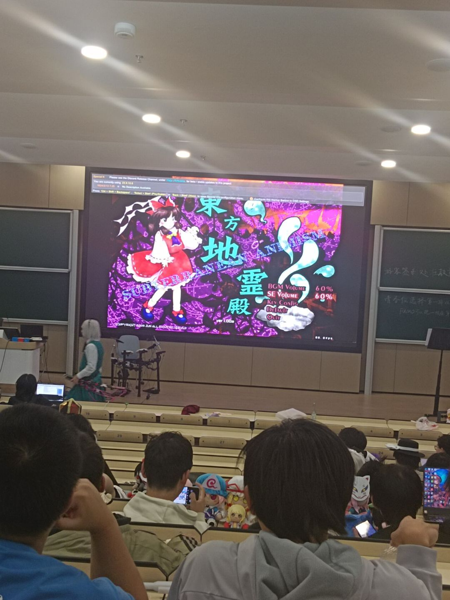
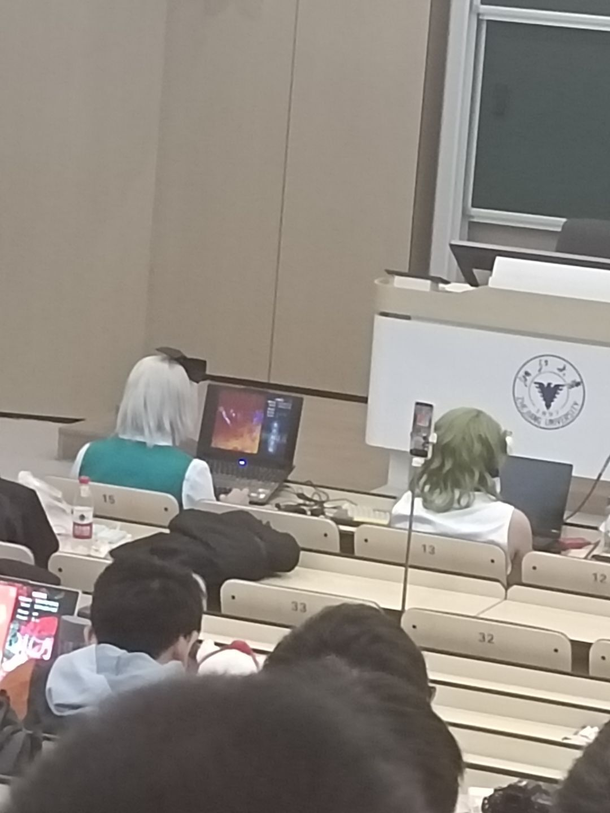
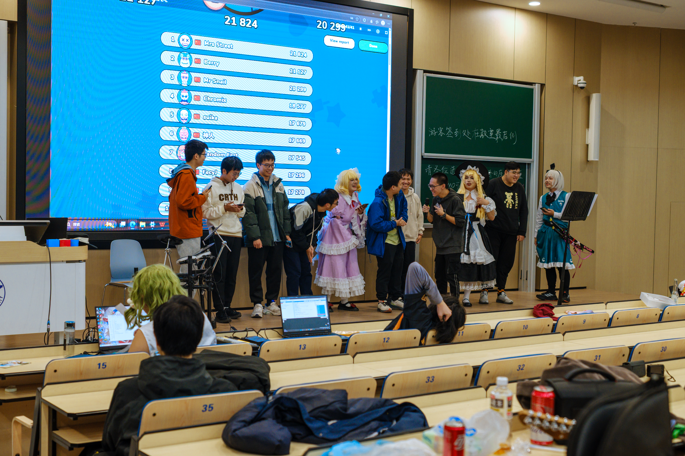
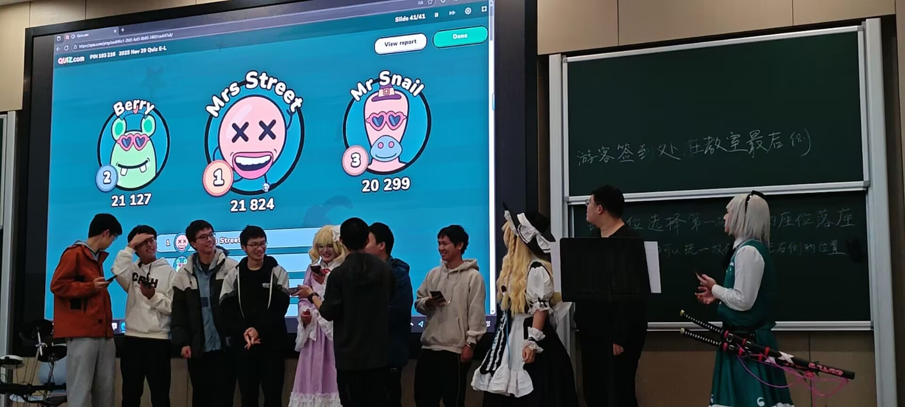
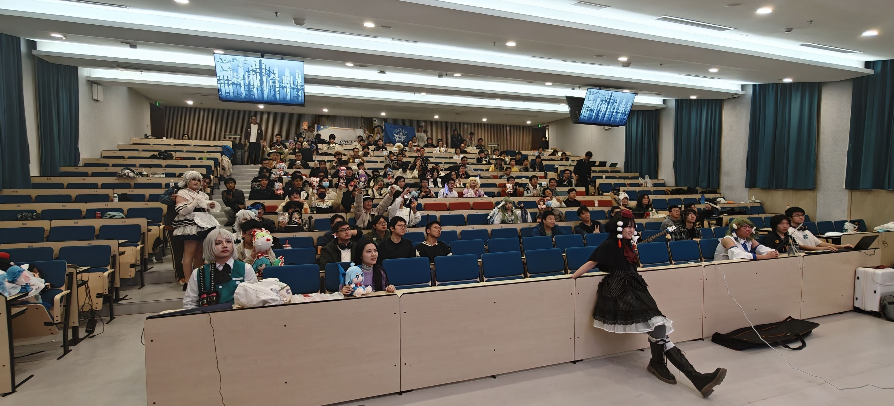
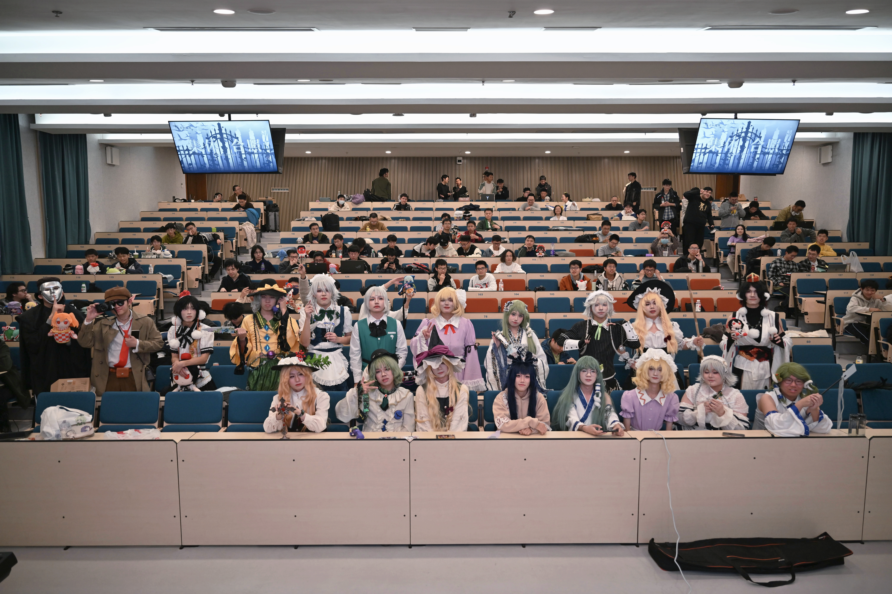

---
hide:
  - toc
---

# 20251129浙高联

<article class="course-main course-article" markdown="1">

## 个人

<figure class="course-figure" markdown="1">

</figure>
<figure class="course-figure" markdown="1">

</figure>

## STG环节

<figure class="course-figure" markdown="1">

</figure>
<figure class="course-figure" markdown="1">

</figure>

## 舞台答题

<figure class="course-figure" markdown="1">

</figure>
<figure class="course-figure" markdown="1">

</figure>

## 大合照

<figure class="course-figure" markdown="1">

</figure>
<figure class="course-figure" markdown="1">

</figure>

</article>

<aside class="course-index" aria-label="西行樱庭索引">
  
文章列表

  <a class="course-index__home" href="index.html">总览</a>
  

2025
<a class="is-active" href="20251129-zhegaolian.html">20251129浙高联</a>

  

2026
<a href="20260201-suzhou-tho.html">20260201苏州THO</a><a href="20260405-wuxi-tho.html">20260405无锡THO</a><a href="20260502-ningbo-tho.html">20260502宁波THO</a><a href="20260620-zhejiang-tho.html">20260620浙江THO</a><a href="20260621-zhejiang-tho-koishi-only.html">20260621浙江THO·古明地恋Only</a><a href="20260809-anhui-tho.html">20260809安徽THO</a><a href="20260926-hangzhou-youyingxihui.html">20260926杭州游映糸会</a>

</aside>

