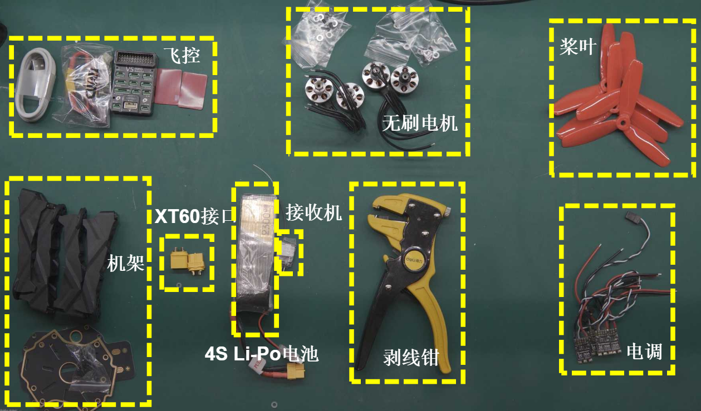
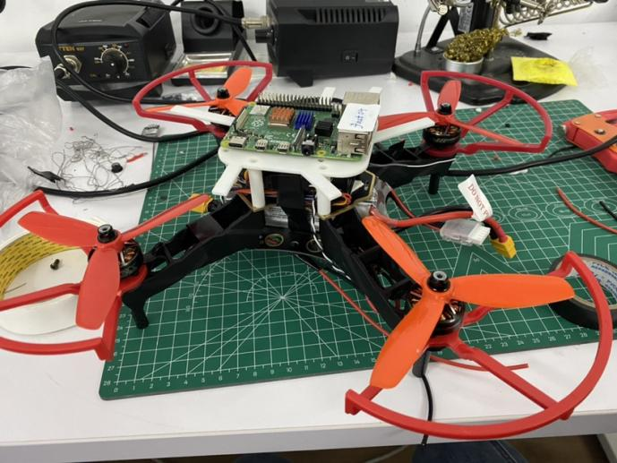
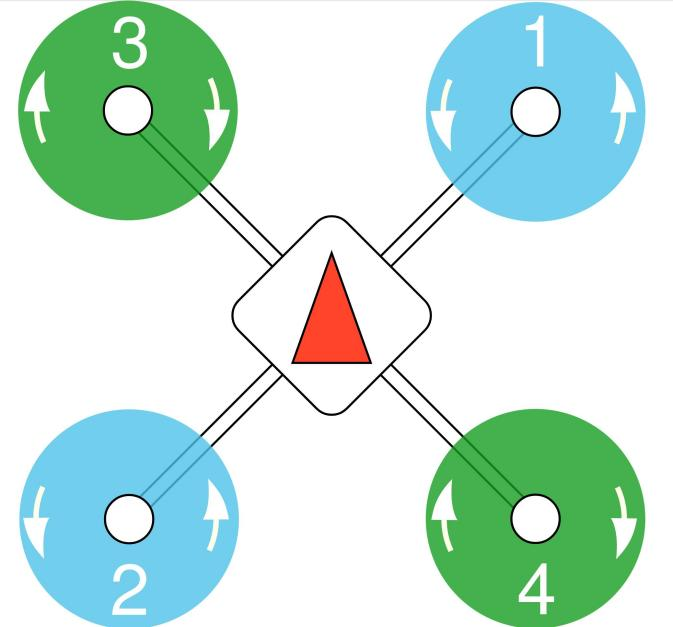
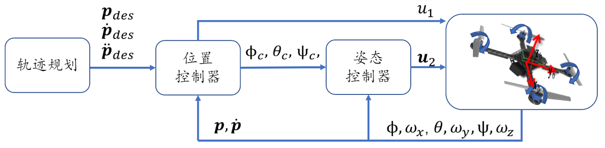
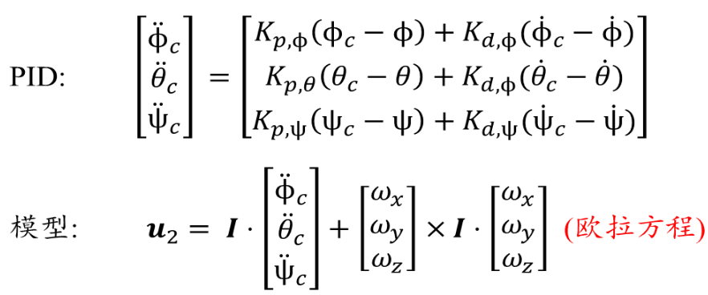
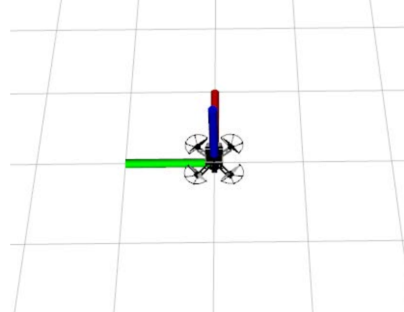
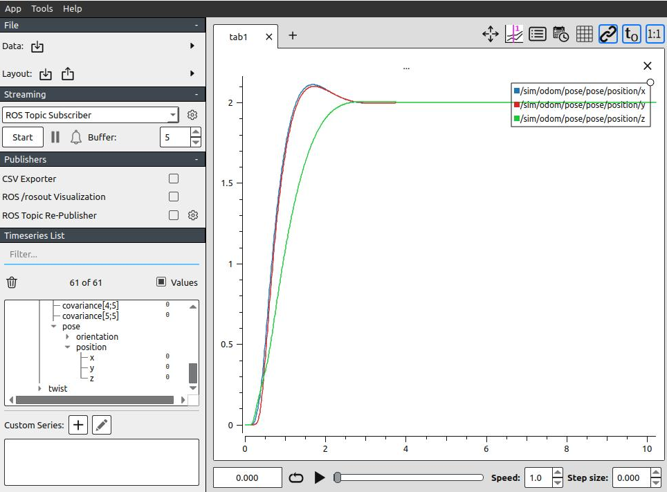
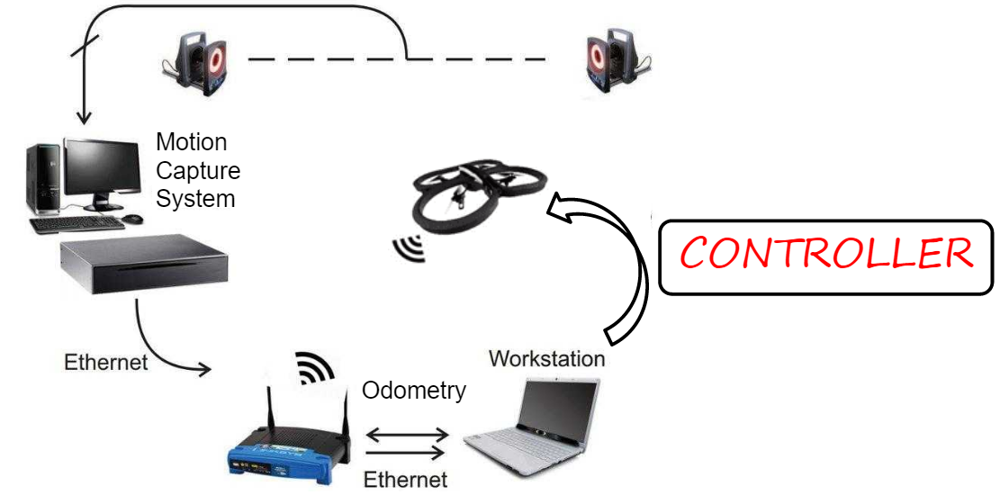

# 空中机器人

<div class="course-layout" markdown="1">
<article class="course-main course-article" markdown="1">

## 实验题目

在这门课里，我完成的题目是“无人机动捕系统下自主悬停”。

实验目的：

- 学习无人机组装与遥控。
- 掌握无人机系统配置。
- 通过实验掌握无人机线性控制。

实验内容：

- 配置系统环境。
- 组装无人机并手控飞行。
- 在动作捕捉系统下实现自主悬停。

实验工具包括 Linux 20.04、ROS Noetic、NoMachine 和 QGroundControl。

## 硬件装配

我当时使用的硬件清单：

| 系统 | 材料 |
| --- | --- |
| 动力系统 | 电机 4 个、电调 4 个、电池 1 个 |
| 控制系统 | 飞控 1 个、遥控器 1 个、接收机 1 个 |
| 机械结构 | 机架、打印件、桨叶保护罩 4 个 |

<div class="course-gallery" markdown="1">
<figure class="course-figure" markdown="1">

<figcaption>装配无人机所需材料。</figcaption>
</figure>
<figure class="course-figure" markdown="1">

<figcaption>动捕实验前的机体组装状态。</figcaption>
</figure>
</div>

焊接记录：

- 焊枪温度约 350~400℃。
- XT60 接头与硅胶线焊接时注意正负。
- 电调等待机臂安装后再走线焊接。
- 飞控安装时注意箭头方向，箭头指向机头。
- 上电后若电机反转，对换三相输入线中的任意两根，或在 Mavlink Console 中使用反转指令。

电机转向要求：以机头为正，1 号与 2 号电机逆时针旋转，3 号与 4 号电机顺时针旋转。

<figure class="course-figure" markdown="1">

<figcaption>四旋翼电机旋转方向。</figcaption>
</figure>

## 飞控设置

QGroundControl 设置记录：

```text
机架：Generic 250 Racer
Channel7：紧急断电通道
电源：4S 后计算
CBRK_IO_SAFETY = 22027
CBRK_USB_CHK = 197848
MAV_1_CONFIG = TELEM 2
SYS_USE_IO = 0
DSHOT_CONFIG = DShot600
```

电机反转时使用：

```text
dshot reverse -m 1
dshot save -m 1
```

## 线性控制器

仿真实验补充 `linear_control.cpp` 中的 `calculateControl` 函数。输入包括期望状态 `des`、当前里程计 `odom`、惯性数据 `imu` 和增益 `gain`，输出控制指令 `u`。

我采用串级 PID，外环控制位置，内环控制姿态。控制框图如下：

<div class="course-gallery" markdown="1">
<figure class="course-figure" markdown="1">

<figcaption>位置外环与姿态内环控制结构。</figcaption>
</figure>
<figure class="course-figure" markdown="1">

<figcaption>姿态控制中的角速度与力矩项。</figcaption>
</figure>
</div>

仿真启动命令：

```text
roslaunch so3_quadrotor_simulator simulator_example.launch
```

<div class="course-gallery" markdown="1">
<figure class="course-figure" markdown="1">

<figcaption>ROS 仿真中的四旋翼模型。</figcaption>
</figure>
<figure class="course-figure" markdown="1">

<figcaption>PlotJuggler 中的仿真里程计曲线。</figcaption>
</figure>
</div>

仿真曲线趋于稳定并收敛。

## 动捕实操

动捕实验准备：

- 给树莓派加 5V 稳压模块供电。
- 用绝缘胶带包裹外露焊点。
- 将树莓派固定在机体顶端。
- 粘贴动捕球 marker，保持距离尽可能大，并保留非对称性。

动捕连接：

- 启动或改变动捕装置位置后重新标定。
- 使用相机标定杆采样，五个动捕装置采样数均超过约 10000。
- 放置地面标定杆进行地面识别。
- 树莓派、远程 NoMachine 与动捕网络保持在同一局域网。
- 通过 vrpn 连接，能够读取四旋翼位姿和遥控器指令时连接正常。

<figure class="course-figure" markdown="1">

<figcaption>动捕系统、里程计、工作站和控制器关系。</figcaption>
</figure>

调试记录：

- 手飞测试初期出现无法正常飞行和地面打转。
- 检查电池电压、螺旋桨转向和飞控 PID 参数后，完成平稳手控飞行。
- 悬停测试中出现超调运动、剧烈振荡、动力不足和偏航。
- 使用 rosbag 记录里程计信息，在 PlotJuggler 中查看曲线，多次修改代码和参数后完成悬停。

</article>

<aside class="course-index" aria-label="寺子屋索引">
  <p class="course-index__title">文章列表</p>
  <a class="course-index__home" href="index.html">总览</a>
  <div class="course-index__group"><p>基础数理</p><a href="numerical-methods.html">计算方法</a><a href="oop.html">OOP</a><a href="embedded-systems.html">嵌入式系统</a></div>
  <div class="course-index__group"><p>外语</p><a href="english-lexicology.html">英语词汇学</a><a href="japanese.html">日语</a></div>
  <div class="course-index__group"><p>专业课及其实践</p><a href="robotic-arm.html">机器人学：机械臂</a><a href="mobile-robot.html">机器人学：移动机器人</a><a href="pallet-robot.html">托盘机器人</a><a class="is-active" href="aerial-robot.html">空中机器人</a><a href="cv.html">CV</a><a href="nlp.html">NLP</a><a href="optimization-control.html">最优化控制</a><a href="thesis-sailboat.html">本科毕业设计</a></div>
  <div class="course-index__group"><p>团队竞赛</p><a href="team.html">团队竞赛</a></div>
</aside>
</div>
