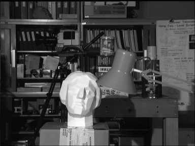
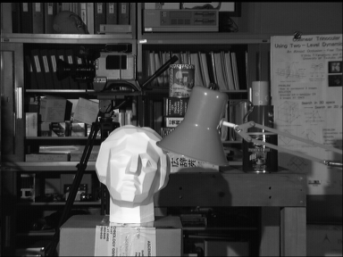
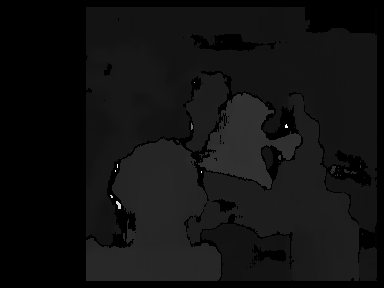
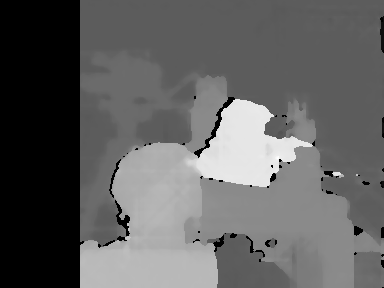
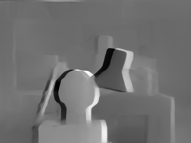
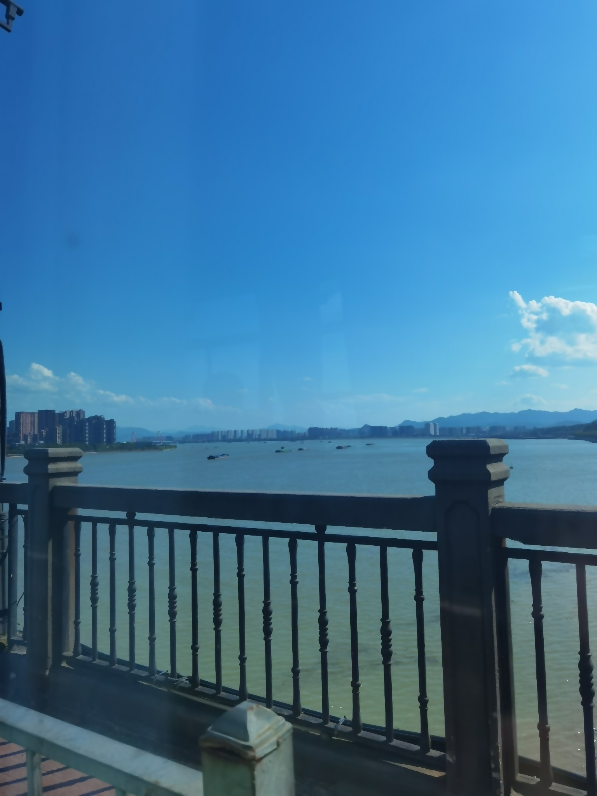

# CV

<div class="course-layout" markdown="1">
<article class="course-main course-article" markdown="1">

## 视差估计

我在视差估计实践中使用 TUKUBA 双目图像对，对比 BM、SGM 和 MiDaS 三种方法。

BM 使用 OpenCV `StereoBM`：

```python
stereo = cv2.StereoBM_create(numDisparities=16*5, blockSize=15)
disparity = stereo.compute(left_image, right_image)
```

SGM 使用 OpenCV `StereoSGBM`：

```python
stereo = cv2.StereoSGBM_create(
    minDisparity=0,
    numDisparities=16*5,
    blockSize=5,
    P1=8*3*5*5,
    P2=32*3*5*5,
    disp12MaxDiff=1,
    uniquenessRatio=10,
    speckleWindowSize=100,
    speckleRange=32
)
```

MiDaS 采用 Intel 实验室推出的轻量级深度学习模型，基于 ResNet 架构和多尺度训练。

<div class="course-gallery" markdown="1">
<figure class="course-figure" markdown="1">

<figcaption>Tsukuba 左图。</figcaption>
</figure>
<figure class="course-figure" markdown="1">

<figcaption>Tsukuba 右图。</figcaption>
</figure>
<figure class="course-figure" markdown="1">

<figcaption>BM 视差图。</figcaption>
</figure>
<figure class="course-figure" markdown="1">

<figcaption>SGM 视差图。</figcaption>
</figure>
<figure class="course-figure" markdown="1">

<figcaption>MiDaS 视差图。</figcaption>
</figure>
</div>

均方误差矩阵：

| MSE | BM | SGM | MiDaS |
| --- | ---: | ---: | ---: |
| BM | 0 | 9172.95 | 9699.51 |
| SGM | 9172.95 | 0 | 4008.90 |
| MiDaS | 9699.51 | 4008.90 | 0 |

从图像效果看，我认为深度学习方法的视差图最好，图像边缘最平滑；SGM 次之，BM 最弱。

## 图像降质

降质处理先做高斯模糊，再加入高斯噪声。

参数记录：

- 高斯核：\(15\times15\)。
- 标准差：根据核大小自动计算。
- 高斯噪声均值：0。
- 高斯噪声标准差：0.6。

<div class="course-gallery" markdown="1">
<figure class="course-figure" markdown="1">

<figcaption>清晰图像。</figcaption>
</figure>
<figure class="course-figure" markdown="1">

<figcaption>高斯模糊后图像。</figcaption>
</figure>
<figure class="course-figure" markdown="1">

<figcaption>模糊并加入噪声后的图像。</figcaption>
</figure>
</div>

## 去噪与超分辨率

去噪使用两种方法：

| 方法 | 参数 |
| --- | --- |
| 高斯滤波 | \(5\times5\) 高斯卷积核，标准差自动计算 |
| 双边滤波 | 邻域直径 9，颜色和空间标准差均为 75 |

<div class="course-gallery" markdown="1">
<figure class="course-figure" markdown="1">

<figcaption>高斯滤波结果。</figcaption>
</figure>
<figure class="course-figure" markdown="1">

<figcaption>双边滤波结果。</figcaption>
</figure>
</div>

超分辨率处理记录：

- 双三次插值使用 OpenCV `INTER_CUBIC`，长宽放大到 2 倍。
- FSRCNN 使用 `FSRCNN_x4.pb` 预训练模型，长宽放大到 4 倍。

```python
sr = cv2.dnn_superres.DnnSuperResImpl_create()
sr.readModel("FSRCNN_x4.pb")
sr.setModel("fsrcnn", 4)
cv2.imwrite("sr_image2.jpg", sr.upsample(denoised_image2))
```

<div class="course-gallery" markdown="1">
<figure class="course-figure" markdown="1">

<figcaption>双三次插值结果。</figcaption>
</figure>
<figure class="course-figure" markdown="1">

<figcaption>FSRCNN 结果。</figcaption>
</figure>
</div>

最后，我认为双边滤波保留的图像细节更多，FSRCNN 的超分辨率结果更清晰。

</article>

<aside class="course-index" aria-label="寺子屋索引">
  <p class="course-index__title">文章列表</p>
  <a class="course-index__home" href="index.html">总览</a>
  <div class="course-index__group"><p>基础数理</p><a href="numerical-methods.html">计算方法</a><a href="oop.html">OOP</a><a href="embedded-systems.html">嵌入式系统</a></div>
  <div class="course-index__group"><p>外语</p><a href="english-lexicology.html">英语词汇学</a><a href="japanese.html">日语</a></div>
  <div class="course-index__group"><p>专业课及其实践</p><a href="robotic-arm.html">机器人学：机械臂</a><a href="mobile-robot.html">机器人学：移动机器人</a><a href="pallet-robot.html">托盘机器人</a><a href="aerial-robot.html">空中机器人</a><a class="is-active" href="cv.html">CV</a><a href="nlp.html">NLP</a><a href="optimization-control.html">最优化控制</a><a href="thesis-sailboat.html">本科毕业设计</a></div>
  <div class="course-index__group"><p>团队竞赛</p><a href="team.html">团队竞赛</a></div>
</aside>
</div>
