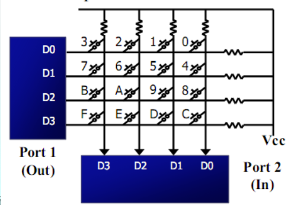
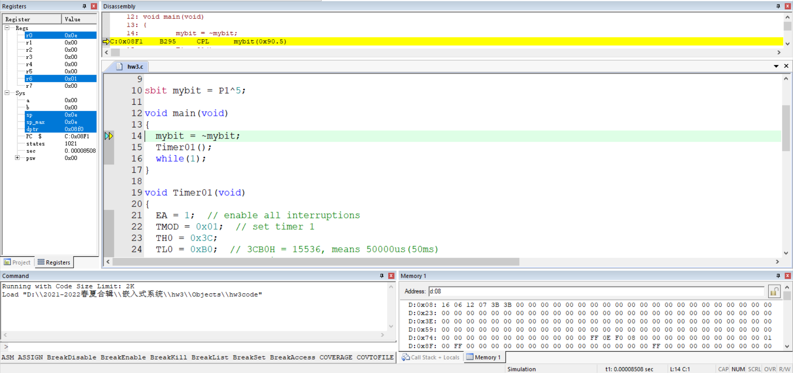
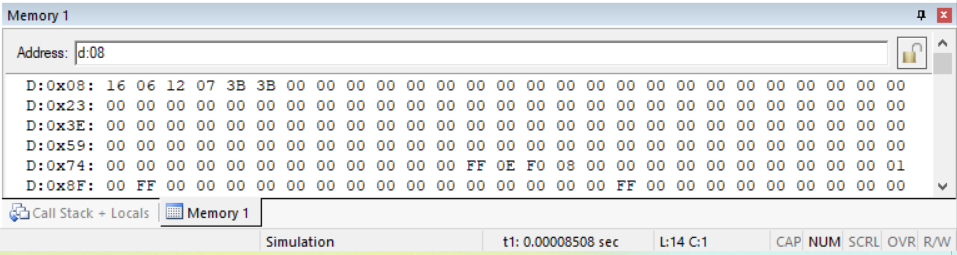

# 嵌入式系统

<div class="course-layout" markdown="1">
<article class="course-main course-article" markdown="1">

## 模拟烤箱数字按键系统

实验目的：

- 了解试验箱器件及其功能。
- 使用单片机控制动态数码管和矩阵按键。
- 编写 C 程序控制单片机。
- 掌握程序烧录过程。

<figure class="course-figure" markdown="1">

<figcaption>矩阵按键示意图。</figcaption>
</figure>

我把矩阵按键检测整理成这一步：按键按下后，P1 得到低电平并记录位置。再让 P1 输入低电平，P2 得到另一个低电平，行列交叉处为按键编号。

动态数码管一次只能输出一位数字编码。程序依次显示各位数字，时间间隔足够短时，人眼看到的是多位同时显示。

接线记录：

| 接口 | 连接 |
| --- | --- |
| P00~P07 | 动态数码管 A~Dp |
| P23、P24、P25 | 动态数码管 A、B、C |
| P10~P17 | 矩阵按键 L4~H1 |

使用方式：

| 按键 | 功能 |
| --- | --- |
| 电源 | 开机，再次按下关机 |
| RSTK1 | 重启程序 |
| S0、S1、S2、S3 | 设置温度为 20、100、180、250 |
| S4、S5 | 升高或降低 1 个单位，长按连续变化 |

我当时遇到的三个问题：

| 问题 | 处理 |
| --- | --- |
| 数码管闪烁 | 将较长 `delay` 拆成小间隔，每个小间隔后刷新显示 |
| 温度增减越界 | 修正边界条件，处理十进制进位和借位 |
| 短按和长按误判 | 无按键时把记忆键设为不存在或无关按键，如 S6 |

关键代码中，矩阵键盘先测列再测行：

```c
GPIO_KEY=0X0F;
switch(GPIO_KEY)
{
    case(0X07): KeyValue=0;break;
    case(0X0b): KeyValue=1;break;
    case(0X0d): KeyValue=2;break;
    case(0X0e): KeyValue=3;break;
}
GPIO_KEY=0XF0;
switch(GPIO_KEY)
{
    case(0X70): KeyValue=KeyValue;break;
    case(0Xb0): KeyValue=KeyValue+4;break;
    case(0Xd0): KeyValue=KeyValue+8;break;
    case(0Xe0): KeyValue=KeyValue+12;break;
}
```

## 温控电机旋转系统

实验使用 STM32 单片机、动态数码管、独立按键、步进电机和 DS18B20 温度传感器。

步进电机每一瞬间只有一个线圈导通。每送一个励磁信号，电机旋转一定角度。励磁顺序反向时，电机反转。

温度传感器读取过程包括初始化时序、写时序和读时序。转换后的温度值以二字节补码存放。正温度乘以 0.0625 得到实际温度，负温度取反加一后再乘以 0.0625。

接线记录：

| 接口 | 连接 |
| --- | --- |
| P00~P07 | 动态数码管 A~Dp |
| P34、P35、P36 | 动态数码管 A、B、C |
| P10~P13 | 步进电机 A~D |
| P17 | LED 灯 D3 |
| P20~P27 | K1~K8 |
| P37 | 温度传感器 J14 |

控制逻辑：

| 条件 | 电机状态 |
| --- | --- |
| S4 关闭 | 不转 |
| S4 打开，实际温度高于设定温度 10 以上 | 逆时针高速 |
| S4 打开，实际温度高于设定温度 | 逆时针低速 |
| S4 打开，实际温度低于设定温度 10 以上 | 顺时针高速 |
| S4 打开，实际温度低于设定温度 | 顺时针低速 |

关键主循环：

```c
temp=DS18B20_Get_Temp();
temper=temp*10;
DigDisplay(temp);
if(ifis_opened){
    if(temper/10 > get_num()*10 + 100) motoz_fast();
    else if(temper/10 > get_num()*10) motoz();
    else if(temper/10 < get_num()*10 - 100) motof_fast();
    else motof();
}
else GPIO_Write(GPIOA,0xffff);
```

我当时记录的问题：

- 每次显示前都重新读取温度，会造成显示滞留或闪烁。
- 独立按键接线不完整时，第三个按键无法正常使用。
- 电机高速旋转时函数占用时间较长，数码管刷新变慢并变暗。高速旋转代码中加入显示函数后恢复正常。

## 定时与中断

定时器配置记录：

```c
void Timer01(void)
{
    EA = 1;
    TMOD = 0x01;
    TH0 = 0x3C;
    TL0 = 0xB0;
    ET0 = 1;
    TR0 = 1;
}
```

`3CB0H = 15536`，对应 50000 微秒，也就是 50 ms。中断函数每 20 次计为 1 秒，再做秒、分、时、日、月、年的进位。

<div class="course-gallery" markdown="1">
<figure class="course-figure" markdown="1">

<figcaption>定时与中断实验中的代码截图。</figcaption>
</figure>
<figure class="course-figure" markdown="1">

<figcaption>实验中的内存窗口记录。</figcaption>
</figure>
</div>

1:1 计时实验数据：

| Min(HEX) | Sec(HEX) | Min(DEC) | Sec(DEC) | 折算秒数 | 实测秒数 |
| --- | --- | --- | --- | --- | --- |
| 00 | 32 | 00 | 50 | 51 | 51.39848142 |
| 02 | 0B | 02 | 11 | 132 | 132.75105842 |
| 03 | 3A | 03 | 58 | 239 | 239.08594292 |

1000 倍速实验：

```c
TH0 = 0xFF;
TL0 = 0xCE;  // 0FFCEH = 65486, means 50us
```

| Hour(HEX) | Min(HEX) | Sec(HEX) | Min(DEC) | Sec(DEC) | Sec(×1000) | 实测秒数 |
| --- | --- | --- | --- | --- | --- | --- |
| 09 | 14 | 07 | 80 | 07 | 4808 | 4.95255317 |
| 0B | 19 | 14 | 205 | 20 | 13521 | 12.69145292 |

</article>

<aside class="course-index" aria-label="寺子屋索引">
  <p class="course-index__title">文章列表</p>
  <a class="course-index__home" href="index.html">总览</a>
  <div class="course-index__group"><p>基础数理</p><a href="numerical-methods.html">计算方法</a><a href="oop.html">OOP</a><a class="is-active" href="embedded-systems.html">嵌入式系统</a></div>
  <div class="course-index__group"><p>外语</p><a href="english-lexicology.html">英语词汇学</a><a href="japanese.html">日语</a></div>
  <div class="course-index__group"><p>专业课及其实践</p><a href="robotic-arm.html">机器人学：机械臂</a><a href="mobile-robot.html">机器人学：移动机器人</a><a href="pallet-robot.html">托盘机器人</a><a href="aerial-robot.html">空中机器人</a><a href="cv.html">CV</a><a href="nlp.html">NLP</a><a href="optimization-control.html">最优化控制</a><a href="thesis-sailboat.html">本科毕业设计</a></div>
  <div class="course-index__group"><p>团队竞赛</p><a href="team.html">团队竞赛</a></div>
</aside>
</div>
