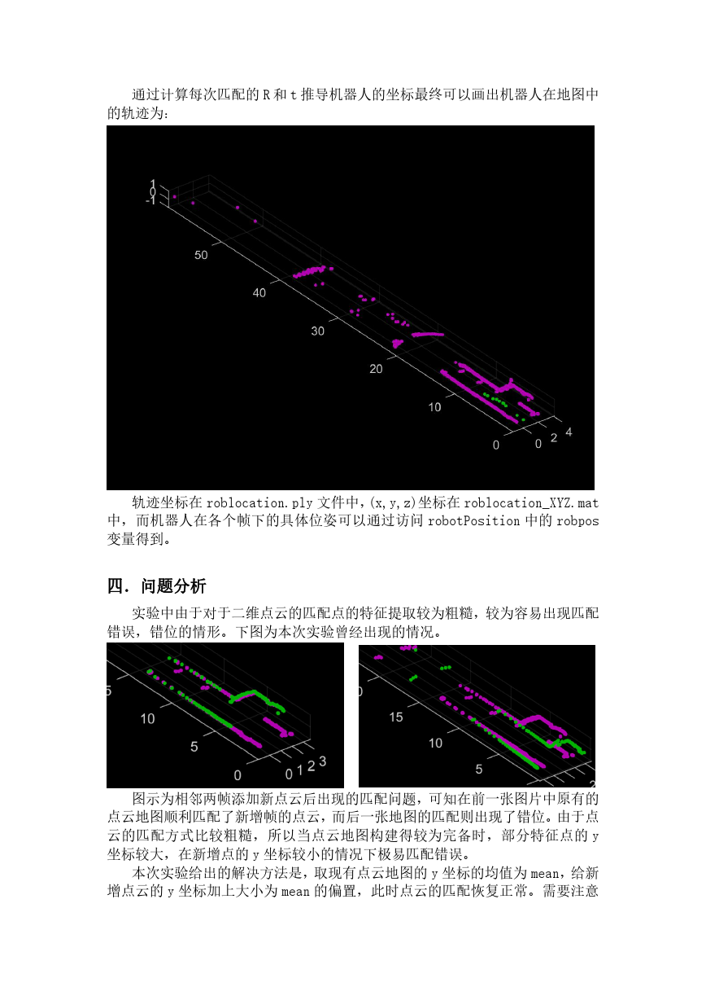
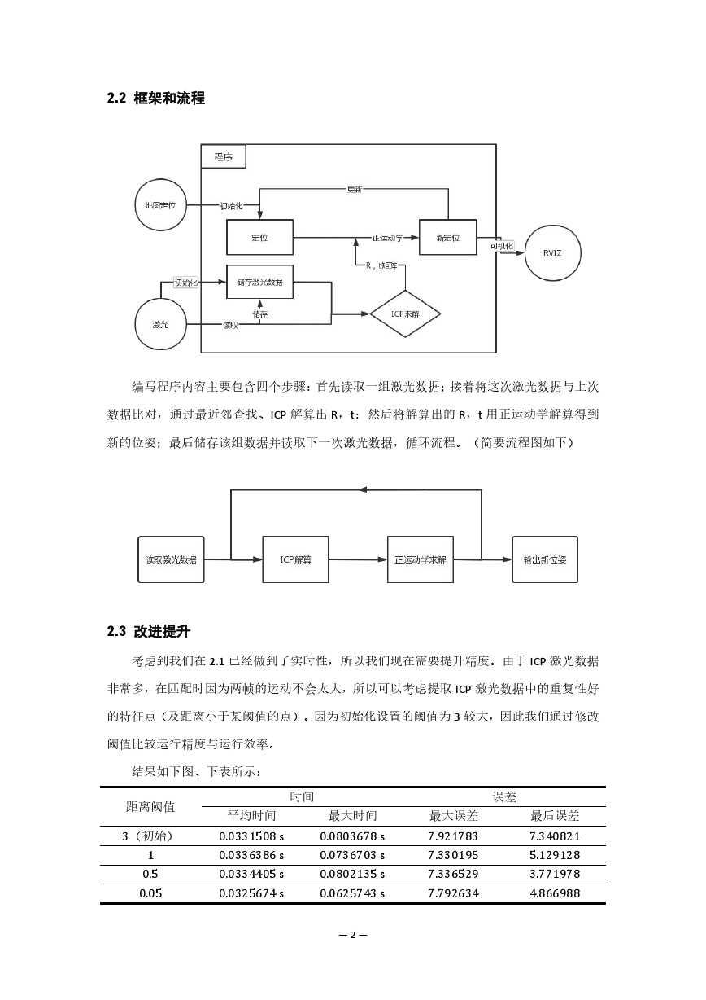
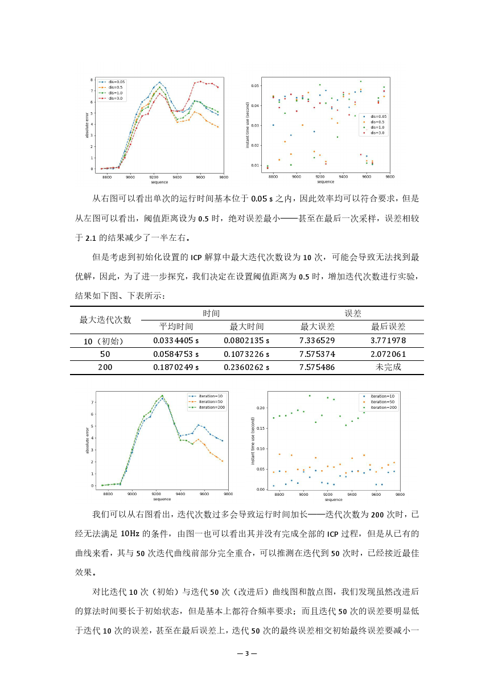

# 机器人学：移动机器人

<article class="course-main course-article" markdown="1">

## 二维点云 ICP

我在 ICP 定位实验中使用二维点云地图，选取 Point-to-Point ICP，求解相邻帧之间的旋转矩阵 \(R\) 和平移向量 \(t\)。实验做法是合并前 \(n\) 帧点云，再与第 \(n+1\) 帧匹配，构造最小二乘问题。

我的计算流程：

1. 直接计算匹配点。数据量可接受，第一版 ICP 中未使用 KD-tree。
2. 计算每个点的去质心坐标。
3. 使用 SVD 分解求解 \(R\)。
4. 由 \(R\) 计算 \(t\)。
5. 合并新点云并记录机器人位姿。

主要函数整理：

| 函数 | 作用 |
| --- | --- |
| `icp_demo`、`icp_mapping` | 自带演示代码 |
| `ICP_process` | ICP 核心计算函数 |
| `pointcloudmerge`、`comparison` | 辅助计算和可视化 |
| `result_show` | 主函数，运行后得到点云图 |
| `robotPosition` | 计算各帧位姿，包含 \((x,y,\theta)\) 和位姿矩阵 |

<figure class="course-figure" markdown="1">

<figcaption>ICP 实验中的点云地图、轨迹和改进前后对比页。</figcaption>
</figure>

我遇到的主要问题是：二维点云的匹配点特征提取较粗糙，之后的帧可能在已有点云地图上错位。改进时使用点云地图的 \(y\) 坐标均值限制新增点，减少错误匹配。

## ROSBag 轨迹实践

机器人学 II 实践使用 ROSBag 与 RViz 跑出轨迹。第一版最近邻使用暴力循环搜索，运行时间较长。之后改用 KD-tree 加速匹配，满足实时运行要求。

通过验收的基础数据：

| 平均时间 | 最大时间 | 最大误差 | 最终误差 |
| ---: | ---: | ---: | ---: |
| 0.0331508 s | 0.0803678 s | 7.921783 | 7.340821 |

我的流程为：

1. 读取一组激光数据。
2. 与上次数据比对。
3. 通过最近邻查找和 ICP 解算 \(R,t\)。
4. 用正运动学得到新位姿。
5. 保存该组数据，读取下一组激光数据。

<figure class="course-figure" markdown="1">

<figcaption>实践中的流程图与基础定量测试表。</figcaption>
</figure>

## 参数实验

阈值距离实验记录如下：

| 阈值距离 | 平均时间 | 最大时间 | 最大误差 | 最后误差 |
| ---: | ---: | ---: | ---: | ---: |
| 0.5 | 0.0331508 s | 0.0803678 s | 7.330195 | 5.129128 |
| 0.05 | 0.0336386 s | 0.0736703 s | 7.336529 | 3.771978 |
| 0.005 | 0.0334405 s | 0.0802135 s | 7.792634 | 4.866988 |

迭代次数实验记录如下：

| 最大迭代次数 | 平均时间 | 最大时间 | 最大误差 | 最后误差 |
| ---: | ---: | ---: | ---: | ---: |
| 10 | 0.0334405 s | 0.0802135 s | 7.336529 | 3.771978 |
| 50 | 0.0584753 s | 0.1073226 s | 7.575374 | 2.072061 |
| 200 | 0.1870249 s | 0.2360262 s | 7.575486 | 未完成 |

<figure class="course-figure" markdown="1">

<figcaption>阈值距离和迭代次数实验曲线。</figcaption>
</figure>

## EKF 融合定位

我在融合定位部分使用 EKF。状态预测来自里程计，观测更新来自地图匹配。002bag 前段时间保持收敛，约半分钟后最近邻匹配失败，误差迅速发散。

我当时列出的原因：

- 阈值距离过小，有效匹配点不足。
- EKF 计算式可能出现不稳定项。

</article>

<aside class="course-index" aria-label="寺子屋索引">
  
文章列表

  <a class="course-index__home" href="index.html">总览</a>
  

基础数理
<a href="numerical-methods.html">计算方法</a><a href="oop.html">OOP</a><a href="embedded-systems.html">嵌入式系统</a>

  

外语
<a href="english-lexicology.html">英语词汇学</a><a href="japanese.html">日语</a>

  

专业课及其实践
<a href="robotic-arm.html">机器人学：机械臂</a><a class="is-active" href="mobile-robot.html">机器人学：移动机器人</a><a href="pallet-robot.html">托盘机器人</a><a href="aerial-robot.html">空中机器人</a><a href="cv.html">CV</a><a href="nlp.html">NLP</a><a href="optimization-control.html">最优化控制</a><a href="thesis-sailboat.html">本科毕业设计</a>

  

团队竞赛
<a href="team.html">团队竞赛</a>

</aside>

