# NLP

<article class="course-main course-article" markdown="1">

## VQA 任务

实验选题为 Visual Question Answering。输入是一张图片和一个关于图片内容的自然语言问题，输出为正确答案。

数据集由训练集、验证集和测试集组成，每部分包含图片、问题 JSON 和答案 JSON。

实验环境：

| 部分 | 环境 |
| --- | --- |
| PyTorch 基线 | Windows 10，PyCharm，Python 3，PyTorch 1.8.1，torchvision 0.9.1 |
| MindSpore 尝试 | ModelArts Ascend Notebook，mindspore1.7.0-cann5.1.0-py3.7-euler2.8.3，Ascend 910 |
| Bottom-Up Top-Down | Ubuntu 22.04，Python 3.6，PyTorch 1.10.2 + CUDA 11.3 + cuDNN 8.2，RTX 3090 Ti |

## 双通道视觉语言模型

我先实现基础 VQA 算法。图像部分使用 VGGNet 提取特征，问题部分使用 LSTM 得到文本特征。两个模态做元素积后进入 softmax 层输出答案概率。

训练参数：

| 参数 | 值 |
| --- | --- |
| batch size | 256 |
| epochs | 30 |
| step size | 10 |
| optimizer | Adam |
| learning rate | 0.001 |
| lr gamma | 0.1 |

<figure class="course-figure" markdown="1">
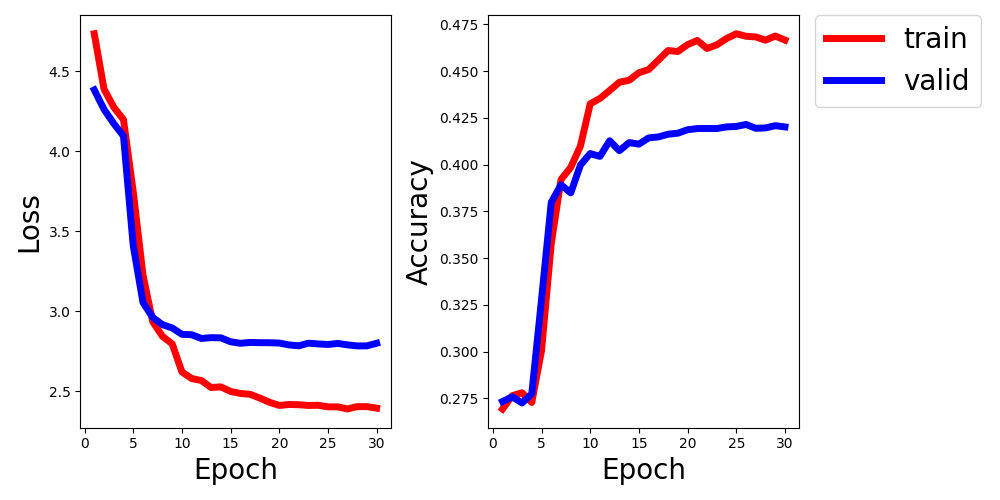
<figcaption>双通道视觉语言模型训练曲线。</figcaption>
</figure>

## Bottom-Up Top-Down

Bottom-Up Top-Down 部分先做图片预处理、JSON 预处理和词汇表构建。图像采用 ResNet152 分割并提取特征，再使用注意力机制融合图片与文本特征。

<figure class="course-figure" markdown="1">
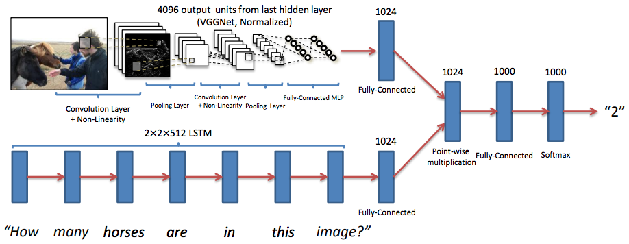
<figcaption>VQA 数据与答案空间流程。</figcaption>
</figure>
<figure class="course-figure" markdown="1">
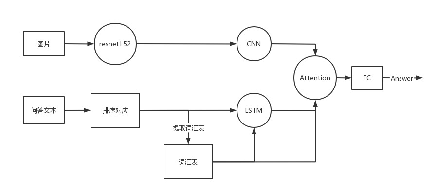
<figcaption>Bottom-Up Top-Down 注意力结构。</figcaption>
</figure>

训练参数：

| 参数 | 值 |
| --- | --- |
| batch size | 128 |
| epochs | 50 |
| dropout | 0.5 |
| optimizer | Adam |
| learning rate | 0.001 |
| lr halflife | 50000 |

调参结果：

| 调整 | 结果 |
| --- | --- |
| 增大学习率半衰期 | 验证集准确率仍约 0.45 |
| dropout 调为 0.65 | 验证集准确率仍约 0.45，训练集上升更慢 |
| batch size 调为 32 | 验证集准确率仍约 0.45 |

<figure class="course-figure" markdown="1">
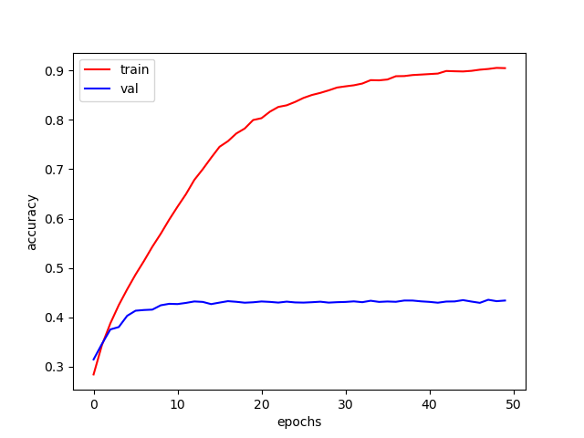
<figcaption>训练集与验证集准确率。</figcaption>
</figure>
<figure class="course-figure" markdown="1">
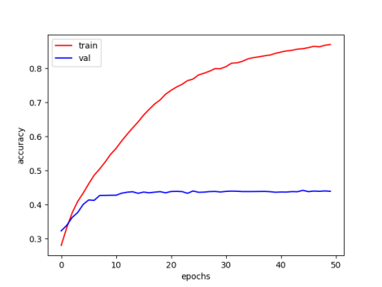
<figcaption>调整学习率半衰期后的准确率。</figcaption>
</figure>
<figure class="course-figure" markdown="1">
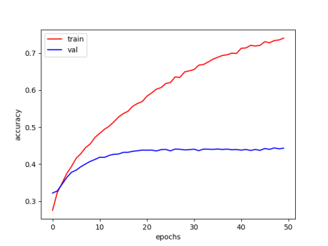
<figcaption>调高 dropout 后的准确率。</figcaption>
</figure>
<figure class="course-figure" markdown="1">
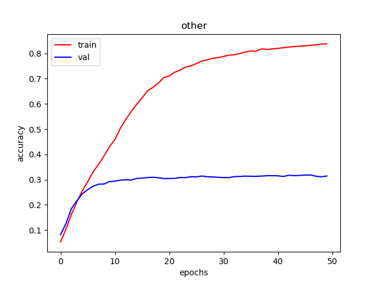
<figcaption>减小 batch size 后的准确率。</figcaption>
</figure>

## MindSpore 尝试

我还尝试把 PyTorch 代码迁移到 MindSpore。

迁移过程中遇到的问题：

- 课程数据包含 annotation、question 和 image 三个层面，MindSpore 预构建的 CocoDataset 少了 question 层。
- 自定义数据集可以建立图片、问题、答案之间的联系。
- 使用 MindSpore 数据集生成方法后，最终得到字典迭代器，无法随机访问，批分配也会改变数据集类型。
- mindspore_hub 的 VGG19 只加载网络结构，未直接加载训练后参数。
- 训练流程最终停在反向传播一步，输入、输出和损失计算已经完成。

## 使用提取后的图像特征训练

我随后使用 Faster R-CNN 提取兴趣区域，再用 ResNet-101 提取 2048 维特征。对每个区域使用基于 IoU 阈值的非极大值抑制。

训练设置：

| 参数 | 值 |
| --- | --- |
| batch size | 32 |
| epochs | 50 |
| lr decay step | 1 |
| optimizer | Adamax |
| learning rate | 1e-3 |
| lr decay rate | 0.9 |

学习率 warm-up：前 8 个 epochs 中，每两个 epoch 分别设为 \(0.5lr\)、\(1lr\)、\(1.5lr\)、\(2lr\)，之后指数衰减。

<figure class="course-figure" markdown="1">
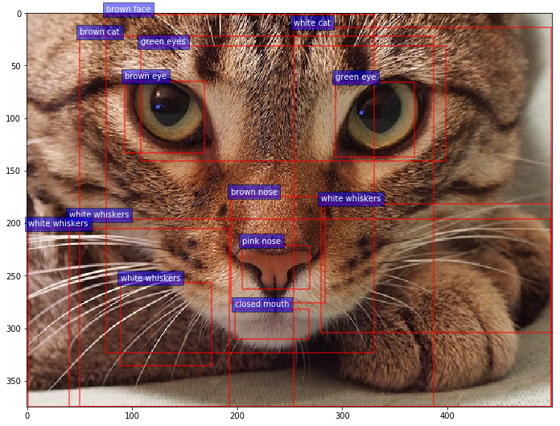
<figcaption>图像兴趣区域检测示例。</figcaption>
</figure>
<figure class="course-figure" markdown="1">
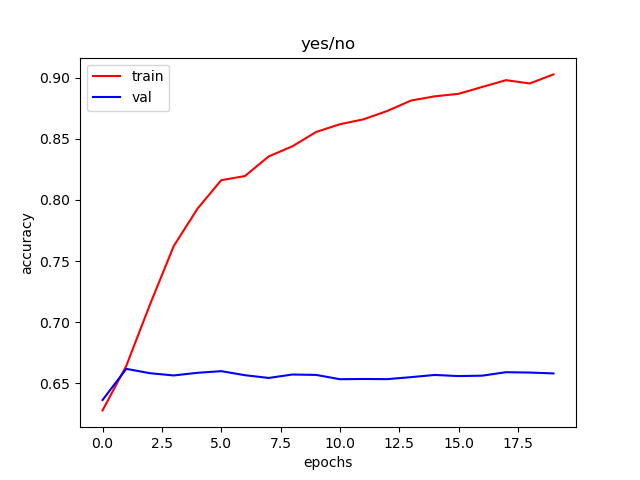
<figcaption>yes/no 类问题曲线。</figcaption>
</figure>
<figure class="course-figure" markdown="1">
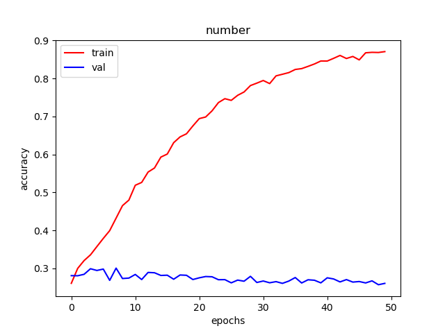
<figcaption>number 类问题曲线。</figcaption>
</figure>
<figure class="course-figure" markdown="1">
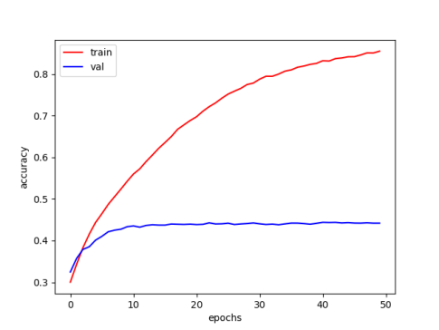
<figcaption>other 类问题曲线。</figcaption>
</figure>

训练集准确率达到约 0.9，验证集准确率约 0.45。按问题类型拆分后，yes/no 和 number 在训练集上接近 100%，验证集较早收敛。

</article>

<aside class="course-index" aria-label="寺子屋索引">
  
文章列表

  <a class="course-index__home" href="index.html">总览</a>
  

基础数理
<a href="numerical-methods.html">计算方法</a><a href="oop.html">OOP</a><a href="embedded-systems.html">嵌入式系统</a>

  

外语
<a href="english-lexicology.html">英语词汇学</a><a href="japanese.html">日语</a>

  

专业课及其实践
<a href="robotic-arm.html">机器人学：机械臂</a><a href="mobile-robot.html">机器人学：移动机器人</a><a href="pallet-robot.html">托盘机器人</a><a href="aerial-robot.html">空中机器人</a><a href="cv.html">CV</a><a class="is-active" href="nlp.html">NLP</a><a href="optimization-control.html">最优化控制</a><a href="thesis-sailboat.html">本科毕业设计</a>

  

团队竞赛
<a href="team.html">团队竞赛</a>

</aside>

