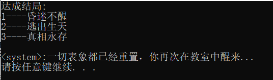
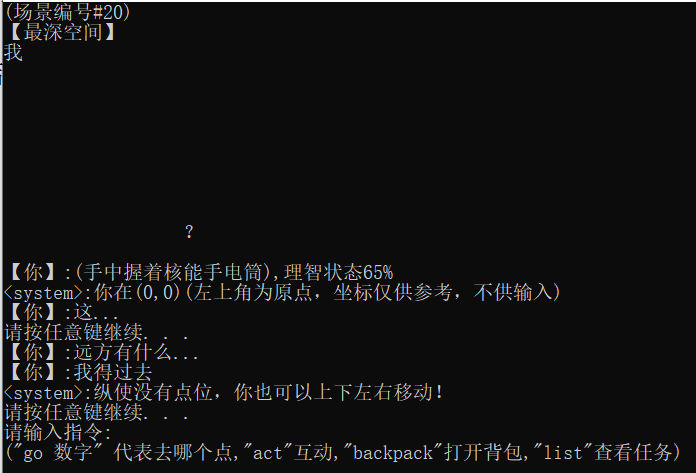

# OOP

<div class="course-layout" markdown="1">
<article class="course-main course-article" markdown="1">

## 周练

我完成了表达式求值和成绩表整理两个练习。

表达式求值读取中缀表达式，将数字保留为非负整数，将运算符映射成负数，再用栈转成后缀表达式。计算阶段再次使用栈弹出左右操作数，支持 `+`、`-`、`*`、`/`、`%` 和括号。

```cpp
case '+': infix.push_back(-1); break;
case '-': infix.push_back(-2); break;
case '*': infix.push_back(-3); break;
case '/': infix.push_back(-4); break;
case '%': infix.push_back(-5); break;
case '(': infix.push_back(-6); break;
case ')': infix.push_back(-7); break;
```

成绩表整理读取逗号分隔的学生、课程和成绩记录，按编号和课程名排序，输出课程成绩表与平均分。

## 引用计数字符串

引用计数字符串由 `String`、`StringRep`、`UCObject`、`UCPointer<T>` 四类组成。

```cpp
class String
{
public:
    String(const char *s) : m_rep(0){
        m_rep = new StringRep(s);
    }
    ~String() {}
    String(const String &s) : m_rep(s.m_rep) {}
    String &operator=(const String &s){
        m_rep = s.m_rep;
        return *this;
    }
    int operator==(const String &s) const{
        return m_rep->equal(*s.m_rep);
    }
    String operator+(const String &s) const{
        return String(m_rep->plus(*s.m_rep));
    }
private:
    UCPointer<StringRep> m_rep;
};
```

`UCPointer<T>` 在构造、拷贝、赋值和析构时维护计数：

```cpp
void increment(){
    if(m_pObj) m_pObj->incr();
}
void decrement(){
    if(m_pObj) m_pObj->decr();
}
UCPointer &operator=(const UCPointer<T> &p){
    if(m_pObj != p.m_pObj){
        decrement();
        m_pObj = p.m_pObj;
        increment();
    }
    return *this;
}
```

使用 g++ 编译后的测试输出：

```text
create		PASS 1 1
create copy	PASS 1 2
length		PASS 1 3
assigment dec	PASS 1 4
assigment ins	PASS 1 5
assigment iso	PASS 1 6
assigment iso2	PASS 1 7
operator ==	PASS 1 8
operator+ 1	PASS 1 9
operator+ 2	PASS 1 10
10
```

## MUD 文字冒险项目

我实现的 MUD 文字冒险游戏包括以下系统：

- 人物系统：理智值、道具背包、点位移动、单步移动、交互、查看任务、背包、说话。
- 场景系统：一楼到四楼、楼梯和密室。相似场景有不同的剧情、道具和交互。
- 道具系统：部分道具需要先获得，再经过交互转化。
- 结局系统：BAD END、NORMAL END、TRUE END。
- 调试指令：`JUMP` 用于跳转场景，`GIVE` 用于发放指定道具。

<div class="course-gallery" markdown="1">
<figure class="course-figure" markdown="1">

<figcaption>终端截图：场景选项和命令输入。</figcaption>
</figure>
<figure class="course-figure" markdown="1">

<figcaption>终端截图：剧情推进和调试命令。</figcaption>
</figure>
</div>

三个结局的达成条件：

| 结局 | 达成条件 |
| --- | --- |
| 昏迷不醒 | 任意时刻理智值低于 0 或等于 0 |
| 逃出生天 | 获得大门钥匙，恢复一楼电力，从大门逃脱 |
| 真相永存 | 理智值高于 50 时进入密室并触发最后剧情 |

探索难点：

- 道具使用方式隐藏在剧情中，玩家需要阅读看似无用的剧情。
- 地图较大，相似场景多，重复探索会受到理智值限制。
- 两个密码的获取和使用方式不同。
- `SPEAK` 与单步移动有特定使用时机。

</article>

<aside class="course-index" aria-label="寺子屋索引">
  <p class="course-index__title">文章列表</p>
  <a class="course-index__home" href="index.html">总览</a>
  <div class="course-index__group"><p>基础数理</p><a href="numerical-methods.html">计算方法</a><a class="is-active" href="oop.html">OOP</a><a href="embedded-systems.html">嵌入式系统</a></div>
  <div class="course-index__group"><p>外语</p><a href="english-lexicology.html">英语词汇学</a><a href="japanese.html">日语</a></div>
  <div class="course-index__group"><p>专业课及其实践</p><a href="robotic-arm.html">机器人学：机械臂</a><a href="mobile-robot.html">机器人学：移动机器人</a><a href="pallet-robot.html">托盘机器人</a><a href="aerial-robot.html">空中机器人</a><a href="cv.html">CV</a><a href="nlp.html">NLP</a><a href="optimization-control.html">最优化控制</a><a href="thesis-sailboat.html">本科毕业设计</a></div>
  <div class="course-index__group"><p>团队竞赛</p><a href="team.html">团队竞赛</a></div>
</aside>
</div>
