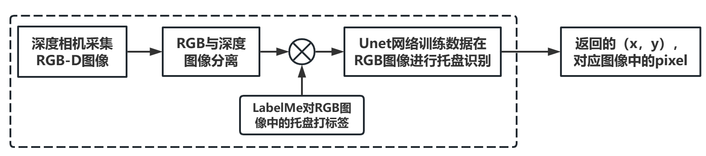
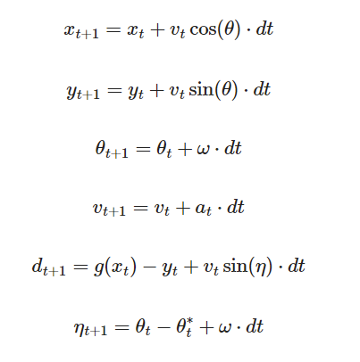
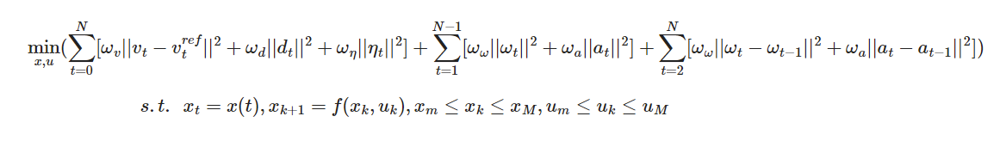
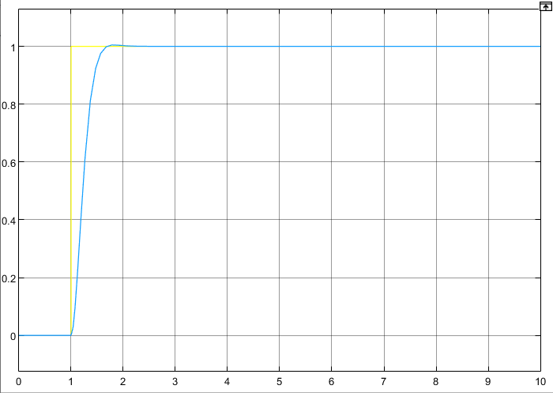
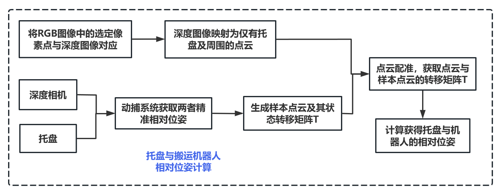
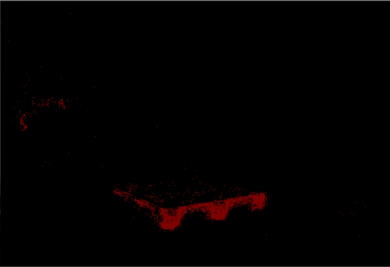
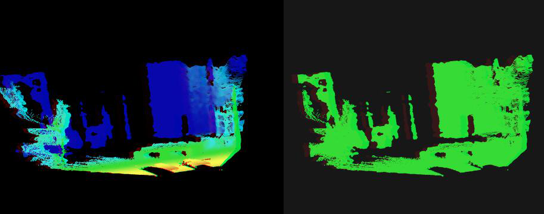
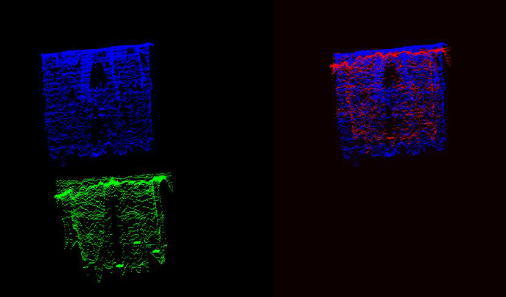
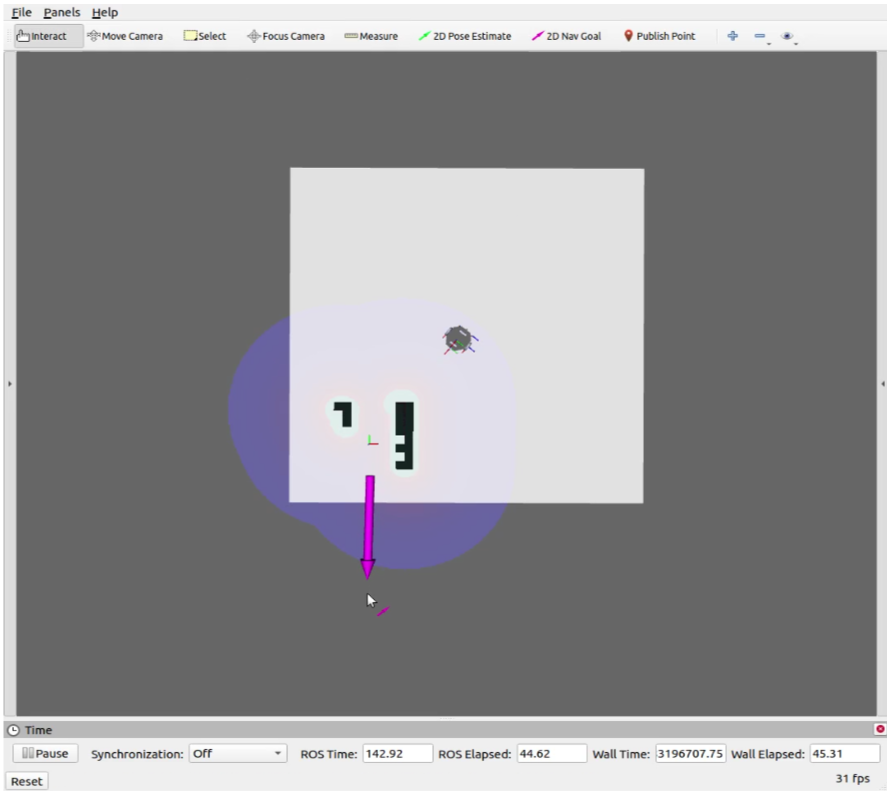
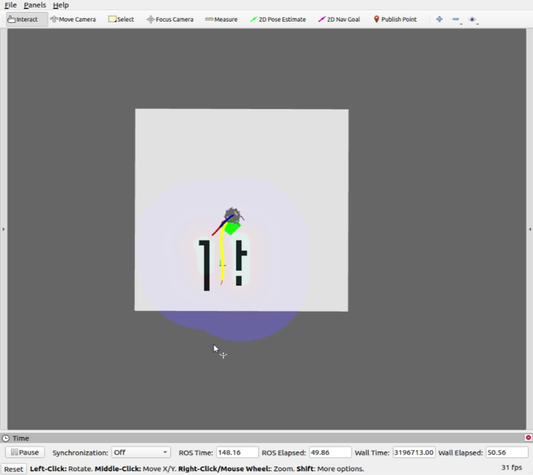

# 托盘机器人

<article class="course-main course-article" markdown="1">

## 目标

在这门实践里，我做的主题是“面向托盘识别应用的搬运机器人运动控制方法研究”。

总体目标：在带有深度相机的搬运机器人上，通过目标检测方法估计托盘的位置和姿态，规划叉车的运动轨迹，实现对货物的精准叉取。

具体目标：

- 利用 MPC 解决从初始位置到目标位置的托盘叉取问题。
- 搭建基于差分驱动约束的搬运机器人运动学与动力学模型。
- 使用图像分割方法识别托盘轮廓，采用模板匹配方法估计托盘位姿。
- 完成实物测试。

<figure class="course-figure" markdown="1">

<figcaption>实验整体流程图。</figcaption>
</figure>

## 运动学与 MPC

我记左轮转速为 \(\omega_1\)，右轮转速为 \(\omega_2\)，轮子半径为 \(r\)，轮子间距为 \(2d\)，机器人位姿为 \(X_R=[x,y,\theta]^T\)。

差分驱动离散模型：

<figure class="course-figure" markdown="1">

<figcaption>差分驱动机器人的运动学更新式。</figcaption>
</figure>

MPC 在每一步求解使损失函数最小的控制量，并执行第一个控制量。损失函数由三部分构成：速度、位置、角度偏差，角速度与线加速度，角速度变化量与线加速度变化量。

<figure class="course-figure" markdown="1">

<figcaption>MPC 目标函数。</figcaption>
</figure>
<figure class="course-figure" markdown="1">

<figcaption>MATLAB 阶跃输入仿真结果。</figcaption>
</figure>

## 托盘识别与点云处理

感知流程：

1. 深度相机采集 RGB-D 图像。
2. 分离 RGB 图像。
3. 使用 LabelMe 标注托盘区域。
4. 训练 U-Net 分割网络。
5. 将分割结果映射回深度数据，提取托盘点云。

<figure class="course-figure" markdown="1">

<figcaption>托盘区域提取流程。</figcaption>
</figure>

点云位姿估计流程：

- 标定标准状态下的托盘点云，得到已知矩阵 \(CST\)。
- 将拍摄得到的托盘点云与标准点云配准，得到 \(SPT\)。
- 托盘与叉车之间的转移矩阵为 \(T=SPT\cdot CST\)。
- 配准采用“SAC-IA 粗配准 + ICP 精配准”。

<figure class="course-figure" markdown="1">

<figcaption>托盘区域分割结果。</figcaption>
</figure>
<figure class="course-figure" markdown="1">

<figcaption>托盘区域点云。</figcaption>
</figure>
<figure class="course-figure" markdown="1">

<figcaption>RGB-D、分割和点云处理结果。</figcaption>
</figure>
<figure class="course-figure" markdown="1">

<figcaption>环境点云配准测试。</figcaption>
</figure>

## 结果

我在 ROS 环境中用 MPC 对差分驱动机器人模型进行验证。场景中用两边墙壁模拟托盘卡槽，在给定目标点后，机器人完成运动规划并到达目的地。

<figure class="course-figure" markdown="1">

<figcaption>RViz 仿真初始场景。</figcaption>
</figure>
<figure class="course-figure" markdown="1">

<figcaption>RViz 仿真到达目标附近。</figcaption>
</figure>

实物测试中，搬运机器人完成了不同偏转角度托盘的叉取，基础任务与进阶任务均完成。

实验中遇到的限制：

- 托盘偏转方向过大或距离机器人过远时，点云配准无法完成。
- 地图构建尚未并入这次流程。
- 深度相机性能限制了配准精度。

</article>

<aside class="course-index" aria-label="寺子屋索引">
  
文章列表

  <a class="course-index__home" href="index.html">总览</a>
  

基础数理
<a href="numerical-methods.html">计算方法</a><a href="oop.html">OOP</a><a href="embedded-systems.html">嵌入式系统</a>

  

外语
<a href="english-lexicology.html">英语词汇学</a><a href="japanese.html">日语</a>

  

专业课及其实践
<a href="robotic-arm.html">机器人学：机械臂</a><a href="mobile-robot.html">机器人学：移动机器人</a><a class="is-active" href="pallet-robot.html">托盘机器人</a><a href="aerial-robot.html">空中机器人</a><a href="cv.html">CV</a><a href="nlp.html">NLP</a><a href="optimization-control.html">最优化控制</a><a href="thesis-sailboat.html">本科毕业设计</a>

  

团队竞赛
<a href="team.html">团队竞赛</a>

</aside>

