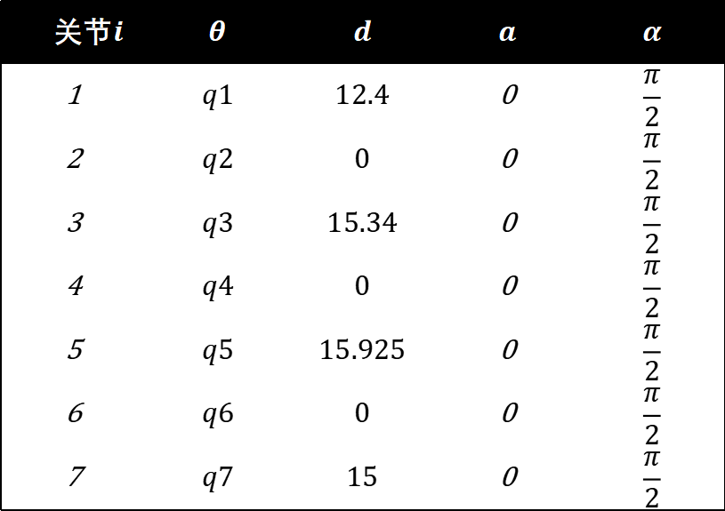
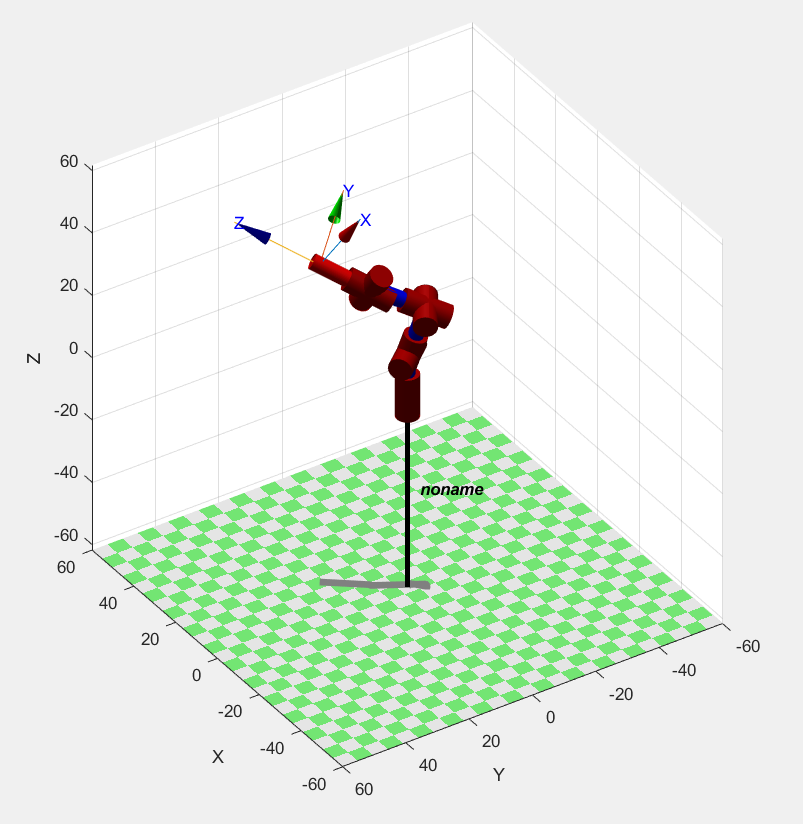
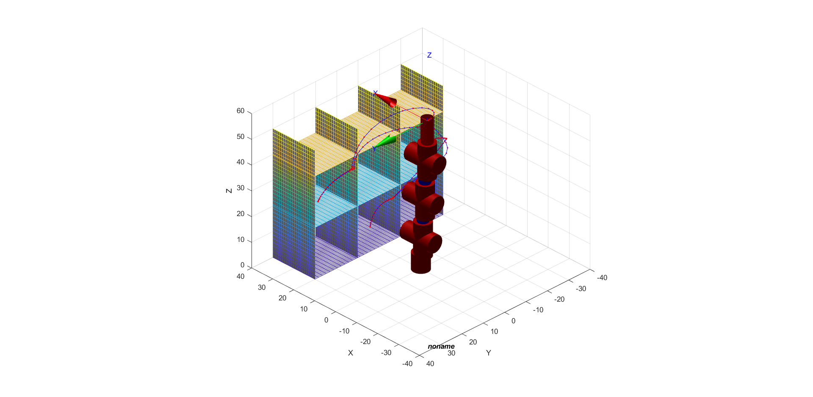
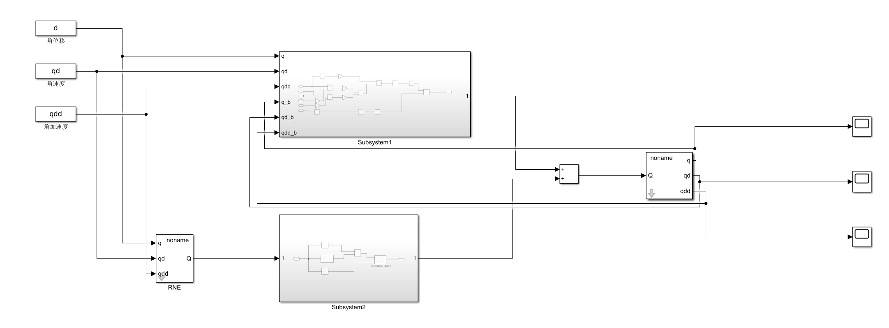
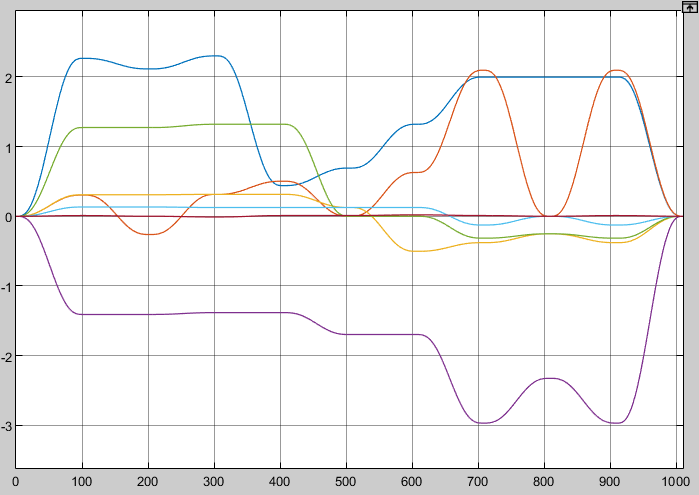
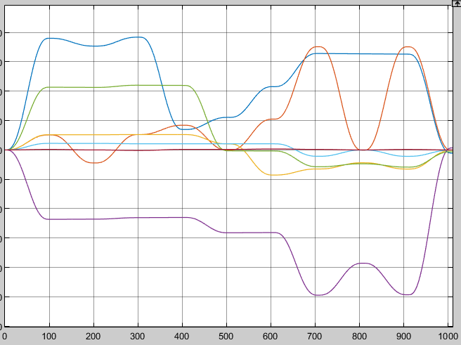

# 机器人学：机械臂

<article class="course-main course-article" markdown="1">

## ZJU-I 桌面机械臂

实验内容为 ZJU-I 型桌面机械臂的正运动学、逆运动学和 CoppeliaSim 仿真验证。

我在实验中使用 modified D-H 参数，末端位姿采用 \(XY'Z'\) 欧拉角表示。D-H 表保留为文字表：

| 关节 | \(\theta\) | \(d\) | \(a\) | \(\alpha\) |
| --- | --- | ---: | ---: | --- |
| 1 | \(q_1\) | 12.4 | 0 | \(\pi/2\) |
| 2 | \(q_2\) | 0 | 0 | \(-\pi/2\) |
| 3 | \(q_3\) | 15.34 | 0 | \(\pi/2\) |
| 4 | \(q_4\) | 0 | 0 | \(-\pi/2\) |
| 5 | \(q_5\) | 15.925 | 0 | \(\pi/2\) |
| 6 | \(q_6\) | 0 | 0 | \(-\pi/2\) |
| 7 | \(q_7\) | 15 | 0 | 0 |

<figure class="course-figure" markdown="1">

<figcaption>PPT 中保存的七自由度机械臂 D-H 参数表。</figcaption>
</figure>

正运动学检验中，仿真值与计算值在位置上保持接近。我摘录两组数据如下：

| 编号 | 类型 | X | Y | Z |
| --- | --- | ---: | ---: | ---: |
| 2 | 计算值 | 0.2455 | 0.2538 | 0.3475 |
| 2 | 仿真值 | 0.2455 | 0.2538 | 0.3471 |
| 4 | 计算值 | -0.2715 | 0.2088 | 0.4728 |
| 4 | 仿真值 | -0.2717 | 0.2090 | 0.4725 |

## 七自由度货物分拣仿真

PPT 的主题为“智能超市自主货物分拣系统”。仿真中使用七自由度机械臂完成货物在货架间的转移。

轨迹规划采用 MATLAB Robotics Toolbox。流程包括：

- 建立机械臂连杆模型。
- 用 `transl` 生成目标齐次变换矩阵。
- 用 `ikine` 求逆运动学关节角。
- 对关节轨迹做时间序列插值。
- 在货架模型中验证层内转移、层间转移和挡板避让。

<figure class="course-figure" markdown="1">

<figcaption>机械臂初始仿真姿态。</figcaption>
</figure>
<figure class="course-figure" markdown="1">

<figcaption>货架场景中的机械臂运动。</figcaption>
</figure>

## 控制器

控制结构采用前馈力矩补偿加关节 PID。PPT 中的控制框图如下：

<figure class="course-figure" markdown="1">

<figcaption>前馈与关节 PID 控制结构。</figcaption>
</figure>

仿真曲线分别记录期望关节角、角速度、角加速度和跟踪结果。PPT 中保存的曲线如下：

<figure class="course-figure" markdown="1">

<figcaption>关节角轨迹。</figcaption>
</figure>
<figure class="course-figure" markdown="1">

<figcaption>仿真跟踪曲线。</figcaption>
</figure>

PPT 结论记录为：机械臂完成层内转移、层间转移和避障动作。

</article>

<aside class="course-index" aria-label="寺子屋索引">
  
文章列表

  <a class="course-index__home" href="index.html">总览</a>
  

基础数理
<a href="numerical-methods.html">计算方法</a><a href="oop.html">OOP</a><a href="embedded-systems.html">嵌入式系统</a>

  

外语
<a href="english-lexicology.html">英语词汇学</a><a href="japanese.html">日语</a>

  

专业课及其实践
<a class="is-active" href="robotic-arm.html">机器人学：机械臂</a><a href="mobile-robot.html">机器人学：移动机器人</a><a href="pallet-robot.html">托盘机器人</a><a href="aerial-robot.html">空中机器人</a><a href="cv.html">CV</a><a href="nlp.html">NLP</a><a href="optimization-control.html">最优化控制</a><a href="thesis-sailboat.html">本科毕业设计</a>

  

团队竞赛
<a href="team.html">团队竞赛</a>

</aside>

