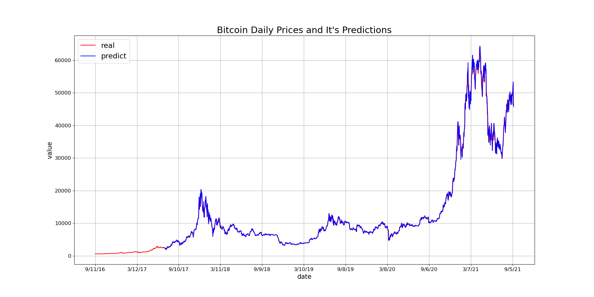
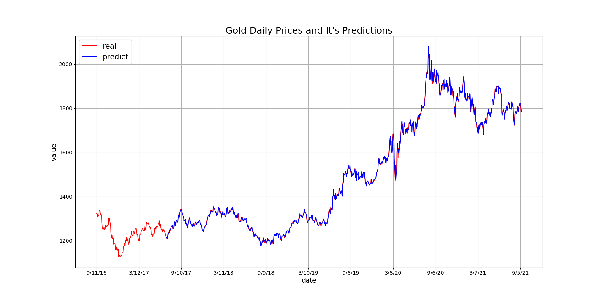
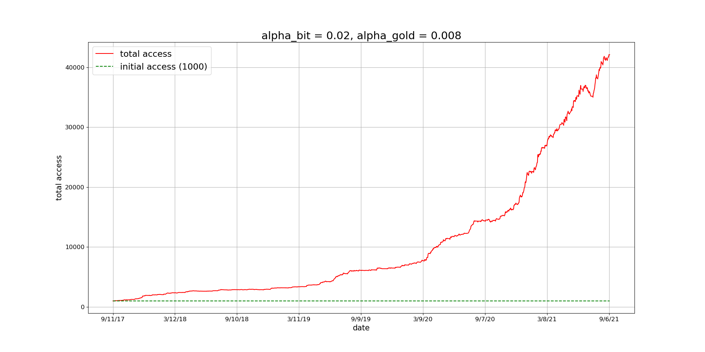
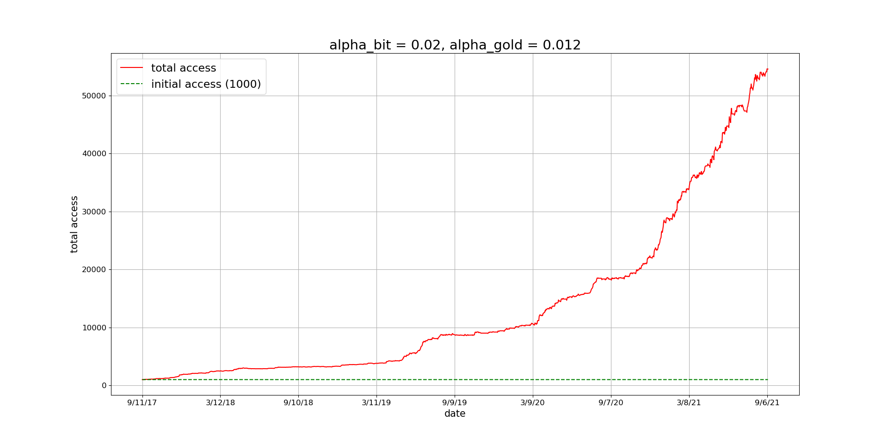

# 美赛

<div class="course-layout" markdown="1">
<article class="course-main course-article" markdown="1">

## 基本记录

| 项目 | 记录 |
| --- | --- |
| 竞赛 | MCM/ICM |
| 结果 | Meritorious Winner |
| 顺位 | 1/3 |
| 额外身份 | Student Advisor |
| 题目 | A Portfolio Investment Model Based on ARIMA Prediction and Risk Assessment |

这次建模围绕黄金与比特币的组合投资。输入是某一天以前的价格数据，输出是之后每天的交易选择和最终资产。

## 数据处理与 ARIMA

黄金存在周末、节假日不交易的缺失价格。先用线性插值补齐价格序列，同时记录黄金当天是否可交易的标签。比特币每日都有价格记录，可以直接进入时间序列预测。

ARIMA 参数按差分阶数、PACF 和 ACF 判断。报告中最后使用：

| 资产 | 差分阶数 \(d\) | AR 阶数 \(p\) | MA 阶数 \(q\) |
| --- | ---: | ---: | ---: |
| Bitcoin | 1 | 2 | 2 |
| Gold | 1 | 2 | 2 |

<div class="course-gallery" markdown="1">
<figure class="course-figure" markdown="1">

<figcaption>Bitcoin 真实价格与预测价格。</figcaption>
</figure>
<figure class="course-figure" markdown="1">

<figcaption>Gold 真实价格与预测价格。</figcaption>
</figure>
</div>

## 简单交易模型

先建立一个只持有现金、黄金、比特币之一的简单模型。每天面对黄金和比特币上涨、下跌组合，共有 4 类预测状态；交易动作包括买入黄金、卖出黄金、买入比特币、卖出比特币，以及黄金与比特币之间经由现金完成的转换。

交易成本记为 \(\alpha\)。买入时，若现金为 \(C\)，当日价格为 \(P\)，买入数量为 \(x\)，则：

\[
C=xP(1+\alpha),\qquad x=\frac{C}{P(1+\alpha)}
\]

卖出时，若持有数量为 \(T\)，卖出后现金为 \(x\)，则：

\[
x=TP(1-\alpha)
\]

这个简单模型在 2021 年 9 月 8 日得到的最终资产为 \(\$39,604\)。它用于检查 ARIMA 对涨跌方向的预测效果，后续再加入风险约束。

## 风险控制模型

风险控制部分使用 AHP。报告中把影响风险承受能力的因素写成四项：

| 因素 | 定量指标 |
| --- | --- |
| 可投资财富 | 可支配收入中已储蓄并投入投资的比例 |
| 收入预期 | 净收入平均增长率 |
| 收入波动 | 收入标准差 |
| 投资意愿 | 投资情绪 |

四类人群对应的比特币最大投资比例为：

| 风险类型 | 比特币比例 |
| --- | ---: |
| Risk Averse | 0.15 |
| Risk Neutral, biased towards aversion | 0.25 |
| Risk Neutral, biased towards preference | 0.35 |
| Risk Preference | 0.45 |

最终模型每天只在可接受风险范围内寻找收益最大的方案。资金状态分为四类：仅现金、现金加比特币、现金加黄金、黄金与比特币组合。若当天黄金不能交易，就排除包含黄金交易的计划。

```python
if gold_cannot_be_traded:
    delete(plan_3)
    delete(plan_4)

plan = max(feasible_plans, key=predicted_return)
```

## 最终结果

模型从 2017 年 9 月 11 日开始运行，到 2021 年 9 月 10 日结束。结果如下：

| 风险类型 | 2021-09-10 最终资产 |
| --- | ---: |
| Risk Averse | \(\$13,940.741\) |
| Risk Neutral, biased towards aversion | \(\$46,220.533\) |
| Risk Neutral, biased towards preference | \(\$143,972.427\) |
| Risk Preference | \(\$425,215.820\) |

对人数最多的风险中性偏保守组，比特币比例固定为 0.25，并比较 0.25 附近更低比例的收益。判断结果为：比例低于 0.25 时收益更小，高于 0.25 时超出该组风险承受范围。

## 交易成本敏感性

比特币交易成本对总资产影响更明显。原因写得很直接：比特币单价高、波动大，即使只投入 25% 资产，单次交易收益也可能大于黄金交易收益。佣金较小时，交易方向不变，变化主要体现在手续费大小；佣金较高时，比特币交易收益被压低，最终资产上限下降。

黄金交易成本的影响较弱。报告中在 \(\alpha_{\text{Bitcoin}}=0.020\) 时扰动黄金佣金，剔除两组波动较大的结果后，最终资产均值为 \(\$49,458\)，总资产仍稳定在均值线附近。

<div class="course-gallery" markdown="1">
<figure class="course-figure" markdown="1">

<figcaption>佣金参数下的总资产曲线。</figcaption>
</figure>
<figure class="course-figure" markdown="1">

<figcaption>另一组黄金交易成本扰动结果。</figcaption>
</figure>
</div>

</article>

<aside class="course-index" aria-label="竹林隐居索引">
  <p class="course-index__title">文章列表</p>
  <a class="course-index__home" href="index.html">总览</a>
  <div class="course-index__group"><p>竞赛</p><a href="zhongkong.html">“中控杯”机器人竞赛</a><a href="cumcm.html">大学生数模</a><a class="is-active" href="mcm.html">美赛</a><a href="npmcm.html">研究生数模</a></div>
  <div class="course-index__group"><p>项目</p><a href="srtp.html">SRTP</a></div>
  <div class="course-index__group"><p>实践</p><a href="alumni.html">回访母校</a><a href="social-practice.html">社会实践</a></div>
</aside>
</div>
