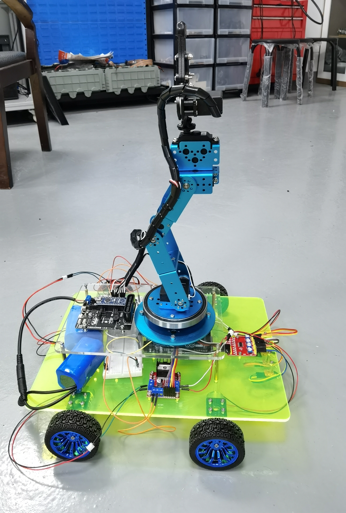
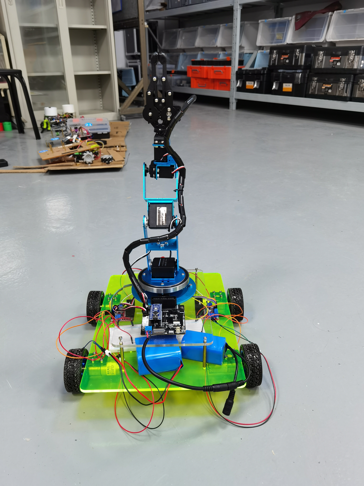

# “中控杯”机器人竞赛

<div class="course-layout" markdown="1">
<article class="course-main course-article" markdown="1">

## 基本记录

| 项目 | 记录 |
| --- | --- |
| 竞赛 | “中控杯”机器人竞赛 |
| 结果 | 校级二等奖 |
| 顺位 | 1/3 |
| 任务 | 超市机器人挑战赛 |

比赛要求机器人在 10 分钟内把正确物品带回起点区。准备时间为 2 分钟，启动前还有 10 秒等待。机器人未展开时长宽高不超过 \(400\times400\times600\)，完全展开后不超过 \(500\times500\times600\)。购物车可以单独设计，长宽限制在 \(300\times300\) 到 \(500\times500\) 之间。

## 得分策略

方案将“购物车”作为核心策略。场地较大，如果完全靠机器人逐个识别、抓取、放回，耗时会被定位和往返路程吃掉。购物车不能连接传感器，因此采用额外机械臂抓取并拖动购物车运动。

购物顺序按目标物品特征分层：

| 优先级 | 物品与处理 |
| --- | --- |
| 第一优先级 | 1 号和 3 号物品尺寸确定、颜色纯，识别难度低，优先收集。 |
| 第二优先级 | 2 号物品尺寸确定，虽然被打乱，但单格颜色纯、特征明显。 |
| 末位优先级 | 4 号和 5 号物品位于较远的 C、D 货架，规格不确定，识别难度高。 |
| 战略放弃 | 6 号物品位于 E 区，货物和干扰物多，位置特殊。 |

货架为双层，机械臂伸缩会影响抓取稳定性。顺序定为先识别下层物品，完成抓取后再处理上层。比赛最后约 1 分钟，如果机器人仍在识别，就停止并定位回起点。如果已经抓到货物，就在“带回”后直接回起点，不再进行后续操作。

## 定位与运动

场地格子白线规格确定，定位采用白线。定位丢失时，机器人可以靠近货架实体做位置矫正。单靠计时会积累误差，因此方案中加入码盘矫正：当正确码盘位置出现白线时，记录为走过一格。

转弯和循线部分采用传感器结合 PID 控制，目标是减小转向误差和直线行走误差。

```text
白线定位 → 码盘校正 → 传感器循线 → PID 修正 → 货架边界矫正
```

## 识别与抓取

1 到 3 号物品特征明显，使用普通颜色传感器即可做抓取判断。4 到 6 号物品特征不固定，方案中保留图像识别路线。

物品摆放深浅、高低不同。机械臂至少需要 3 个自由度保证抓取位置，机器人横向运动和底盘转动都不方便，因此机械臂末端旋转作为第 4 个自由度。

<div class="course-gallery" markdown="1">
<figure class="course-figure" markdown="1">

<figcaption>二审材料中的实物结构，能看到机械臂、底盘、控制板和电源布置。</figcaption>
</figure>
<figure class="course-figure" markdown="1">

<figcaption>实物外形照片，用于记录机械臂高度与底盘空间。</figcaption>
</figure>
</div>

## 影响因素

购物车由机器人带动，稳定性要求高。方案中要求尽量降低机器人重心，购物车也不宜做得太高，避免行进或转弯时翻车。

抓取时还会遇到“抓空”问题。处理方案有两种：在机械臂合适位置增加距离传感器进行定位补正，或适当加长机械臂提高容错率，同时控制机械臂重量。

</article>

<aside class="course-index" aria-label="竹林隐居索引">
  <p class="course-index__title">文章列表</p>
  <a class="course-index__home" href="index.html">总览</a>
  <div class="course-index__group"><p>竞赛</p><a class="is-active" href="zhongkong.html">“中控杯”机器人竞赛</a><a href="cumcm.html">大学生数模</a><a href="mcm.html">美赛</a><a href="npmcm.html">研究生数模</a></div>
  <div class="course-index__group"><p>项目</p><a href="srtp.html">SRTP</a></div>
  <div class="course-index__group"><p>实践</p><a href="alumni.html">回访母校</a><a href="social-practice.html">社会实践</a></div>
</aside>
</div>
