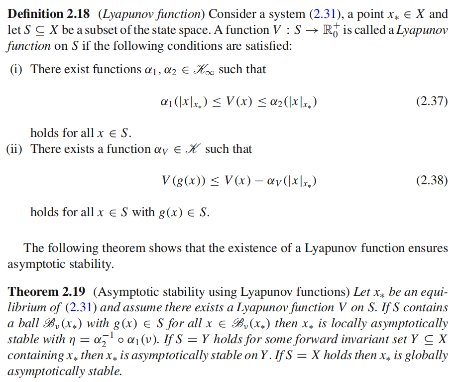
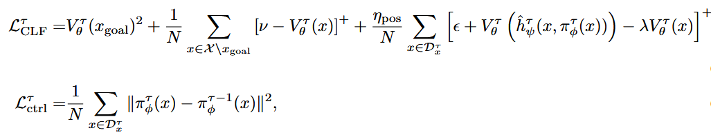

---
hide:
  - toc
---

# LYGE

<div class="course-layout" markdown="1">
<article class="course-main course-article" markdown="1">

## 基本记录

| 项目 | 记录 |
| --- | --- |
| 组会题目 | Learning to Stabilize High-dimensional Unknown Systems Using LYapunov-Guided Exploration |
| 时间 | 2025-09-05 |
| 关键词 | Lyapunov stability, CLF, trusted tunnel, data-driven control |

## Lyapunov 与 CLF

这次汇报从自治非线性系统开始：

\[
\dot{x}=f(x).
\]

若 \(x_e\) 是平衡点，Lyapunov 稳定要求初值足够接近 \(x_e\) 时，轨迹始终留在给定邻域内。渐近稳定还要求：

\[
\lim_{t\to\infty}\|x(t)-x_e\|=0.
\]

Lyapunov 第二方法使用函数 \(V(x)\) 判断稳定性。渐近稳定的条件写作：

\[
V(x_e)=0,\qquad V(x)>0\ (x\ne x_e),\qquad \dot{V}(x)<0\ (x\ne x_e).
\]

<figure class="course-figure" markdown="1">

<figcaption>汇报中引用的 Lyapunov function 定义与渐近稳定定理。</figcaption>
</figure>

控制 Lyapunov 函数 \(V\) 满足：

\[
\alpha_1(\|x-x_{\mathrm{goal}}\|)
\le V(x)\le
\alpha_2(\|x-x_{\mathrm{goal}}\|),
\]

\[
\inf_{u\in U} V(h(x,u))\le \lambda V(x),\qquad \lambda\in(0,1).
\]

使上式成立的输入集合记作：

\[
\mathcal{K}(x)=\{u\in U\mid V(h(x,u))\le \lambda V(x)\}.
\]

## LYGE 流程

汇报讨论离散时间未知动力系统：

\[
x_{t+1}=h(x_t,u_t).
\]

目标是在初始状态 \(x(0)\in X_0\) 下找到控制策略 \(u=\pi(x)\)，使闭环系统渐近稳定到 \(x_{\mathrm{goal}}\)。

算法中同时学习三件事：

- 控制器 \(\pi_\phi\)
- 局部动力学近似 \(h_\psi\)
- 稳定性验证用的 CLF

每轮迭代先用已有数据训练 \(h_\psi^\tau\)，再学习 \(V_\theta^\tau\) 与 \(\pi_\phi^\tau\)，最后用新控制器采集闭环轨迹并扩充数据集：

\[
D_{\tau+1}=D_\tau\cup \Delta D_\tau.
\]

trusted tunnel 定义为距离数据集不超过 \(\gamma\) 的状态集合：

\[
\mathcal{H}_\tau=
\{x\mid \exists x_i\in D_x^\tau,\ \|x-x_i\|\le \gamma\}.
\]

随着轨迹采集，\(\mathcal{H}_\tau\) 扩张到更低 CLF 值的区域。收敛后，LYGE 返回的控制器 \(\pi^\*\) 可在 \(\mathcal{H}^\*\) 中被信任。

## CLF 学习

汇报中使用的可学习 CLF 写成：

\[
V_\theta^\tau(x)
=x^\top S^\top Sx+
p_{\mathrm{NN}}^\top(x)p_{\mathrm{NN}}(x).
\]

其中 \(S\) 和 \(p_{\mathrm{NN}}\) 的参数都包含在 \(\theta\) 中，函数由构造保证非负。训练目标由 CLF 损失和控制器损失组成：

\[
L^\tau=L_{\mathrm{CLF}}^\tau+\eta_{\mathrm{ctrl}}L_{\mathrm{ctrl}}^\tau.
\]

<figure class="course-figure" markdown="1">

<figcaption>汇报中记录的 CLF 损失和控制器损失形式。</figcaption>
</figure>

## 收敛记录

动力学近似在训练数据上的最大误差记为 \(\omega\)：

\[
\|h_\psi^\tau(x_t,\pi_\phi^\tau(x_t))-x_i(t+1)\|\le \omega.
\]

若 \(L_{\mathrm{CLF}}^\tau\) 在每轮迭代中 \(\epsilon'\)-robustly converges，且 margin \(\epsilon\) 足够大，则 LYGE 收敛并返回稳定控制器。汇报中记录的条件为：

\[
\epsilon\ge
\omega\sigma+\frac{L_V}{2}\omega^2
+\gamma\lambda\sigma+\frac{L_V}{2}\gamma
+(1+L_\pi)\gamma L_h\sigma
+\frac{L_V}{2}(1+L_\pi)\gamma L_h
+\epsilon'.
\]

这里 \(L_\pi,L_V\) 分别是控制器和 CLF 梯度的 Lipschitz 常数，\(\sigma\) 是 \(\nabla V_\theta^\tau\) 的上界。

Lemma 8 的形式为：

\[
V_\theta^\tau(h(x,\pi_\theta^\tau(x)))
\le \lambda V_\theta^\tau(x),\qquad
\forall x\in\mathcal{H}_\tau.
\]

我的记录里还把数据多轮扩张画成：

```text
初始示范 → 模仿学习 → 更新局部动力学 → 学习 CLF 与控制器 → 探索 → 扩充数据
```

</article>

<aside class="course-index" aria-label="白玉楼索引">
  <p class="course-index__title">文章列表</p>
  <a class="course-index__home" href="index.html">总览</a>
  <div class="course-index__group"><p>论文</p><a href="neurips2026.html">NeurIPS2026（在投）</a></div>
  <div class="course-index__group"><p>组会</p><a class="is-active" href="lyge.html">LYGE</a><a href="neural-observer-i.html">Neural Observer I</a><a href="feedback-linearization.html">反馈线性化</a><a href="sima.html">SIMA</a><a href="neural-observer-ii.html">Neural Observer II</a><a href="neural-observer-iii.html">Neural Observer III</a><a href="dream2flow.html">Dream2Flow</a><a href="neural-observer-iv.html">Neural Observer IV</a></div>
</aside>
</div>
