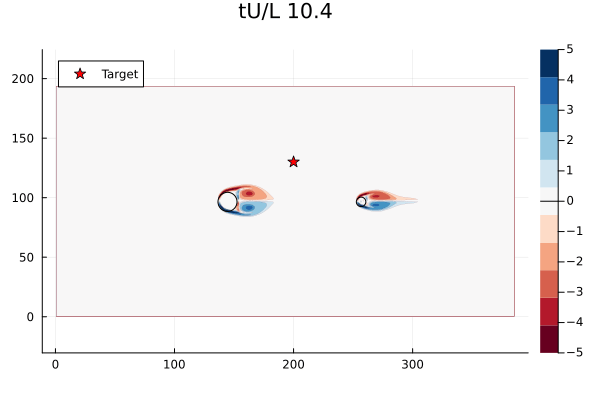

---
hide:
  - toc
---

# Neural Observer II

<div class="course-layout" markdown="1">
<article class="course-main course-article" markdown="1">

## 基本记录

| 项目 | 记录 |
| --- | --- |
| 组会题目 | Neural Observer for Uncertain Systems in WaterLily |
| 时间 | 2026-01-19 |
| 关键词 | WaterLily, fluid disturbance, neural observer, data-driven control |

## Summary

这次组会把几类方法放在同一张表里比较：

| 方法 | 训练时间 | 仿真结果 | 外界扰动估计 | 内部扰动干扰 |
| --- | --- | --- | --- | --- |
| Basic | / | 收敛，有稳态误差 | / | / |
| Linear Observer | / | 数值计算不稳定 | 数值计算不稳定 | / |
| Neural Observer | 较短 | 收敛 | 跟踪性能好 | 影响较小 |
| Data-Driven | 较长 | 发散 | 跟踪性能较差 | / |

组会路线包括 Problem Formulation、Stability Analysis & Generalization、Training Methodology 和 Experiments。实验线分成 LTI 的 X-29、非线性的 Quad-UAV，以及带时变扰动的 WaterLily。

## Problem Statement

考虑二维平面内的物体，控制输入为任意方向力：

\[
u(t)=F(t)=[F_x(t),F_y(t)]^\top.
\]

WaterLily 流体扰动记作 \(f_a\)。为讨论方便取 \(m=1\)。我的记录里把任务写成：在流体环境中设计状态观测器，估计物体状态和外界扰动力。

## Environment

仿真环境为 \(384\times192\) 的 2D 平面。在 \((144,96)\) 位置放置直径 \(D_1=8\) 的固定扰流圆柱。可控制智能体定义为直径 \(D_2=4\) 的圆柱，初始位置 \((256,96)\)，目标位置 \((200,130)\)。

控制方法采用 PID，仿真步长限制为：

\[
\Delta t\le 0.001\ \mathrm{s}.
\]

总时长为 \(t=100\) s。Neural Observer 中取 \(\epsilon=0.01\)，预训练 epoch 为 25000，Tuning 阶段 epoch 为 10000，学习率 \(lr=0.01\)。

<figure class="course-figure" markdown="1">

<figcaption>WaterLily 中的圆柱智能体、固定扰流圆柱与目标点。</figcaption>
</figure>

## 多周期同步

智能体仿真周期为 \(T=0.001\) s，流体仿真周期可变。实际步长取两者最小值。

若流体仿真周期较大，更新流体后会做多步智能体仿真，直到两者同步，再进行下一次流体更新。若流体仿真周期较小，则以流体仿真周期为步长，同步更新流体和智能体。

```text
流体更新 → 智能体多步仿真 → 状态保持 → 下一次流体更新
```

## 实验记录

组会中记录了变初始点和变终点实验。核心观察为：

- Basic 控制能够收敛，但存在稳态误差。
- Linear Observer 在数值计算中不稳定。
- Neural Observer 能在该流体扰动环境中保持收敛。
- 直接 data-driven 控制训练时间更长，仿真记录中出现发散。

</article>

<aside class="course-index" aria-label="白玉楼索引">
  <p class="course-index__title">文章列表</p>
  <a class="course-index__home" href="index.html">总览</a>
  <div class="course-index__group"><p>论文</p><a href="neurips2026.html">NeurIPS2026（Poster）</a></div>
  <div class="course-index__group"><p>组会</p><a href="lyge.html">LYGE</a><a href="neural-observer-i.html">Neural Observer I</a><a href="feedback-linearization.html">反馈线性化</a><a href="sima.html">SIMA</a><a class="is-active" href="neural-observer-ii.html">Neural Observer II</a><a href="neural-observer-iii.html">Neural Observer III</a><a href="dream2flow.html">Dream2Flow</a><a href="neural-observer-iv.html">Neural Observer IV</a></div>
</aside>
</div>
