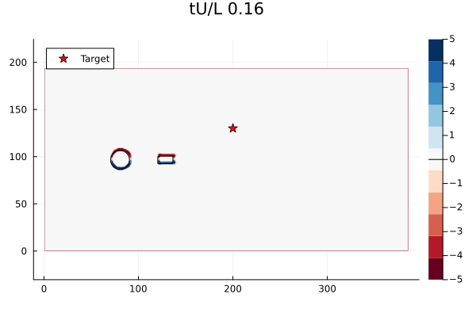

---
hide:
  - toc
---

# Neural Observer III

<article class="course-main course-article" markdown="1">

## 基本记录

| 项目 | 记录 |
| --- | --- |
| 组会题目 | Neural Observer for Stable Control of Uncertain Systems |
| 时间 | 2026-03-14 |
| 关键词 | neural observer, LMI tuning, X-29, Quad-UAV, WaterLily |

## Background

无人机、无人车等无人系统常受到传感器白噪声、特殊环境扰动和未建模动态影响。对于物理模型较成熟的扰动，可以直接从动力学角度估计扰动力。对于难以建模的扰动，我在汇报中沿用神经网络观测器来估计状态和扰动。

Neural Lander 的思路是把无人机位姿、速度和控制量作为神经网络输入，拟合未知扰动力，再把估计扰动力用于控制补偿。汇报中记录的问题是：高空场景可能牺牲控制精度，环境变化较大时需要重新采集数据训练。

## Problem Statement

神经网络观测器跟踪状态和扰动：

\[
\hat{x}'(t)\to x(t),\qquad
\hat{x}''(t)\to d(t).
\]

LTI 系统写成：

\[
\dot{x}(t)=Ax(t)+Bu(t)+d(t),\qquad y(t)=Cx(t).
\]

一般系统写成：

\[
\dot{x}(t)=Ax(t)+Bu(t)+B_\omega K(x,d,t),\qquad y(t)=Cx(t).
\]

对应观测器为：

\[
\begin{aligned}
\dot{\hat{x}}_1(t)
&=A\hat{x}_1(t)+Bu(t)+\pi_1(\epsilon^{-1}(y-\hat{y}))+B_\omega\hat{x}_2(t),\\
\dot{\hat{x}}_2(t)
&=\epsilon^{-1}\pi_2(\epsilon^{-1}(y-\hat{y})),\\
\hat{y}(t)&=C\hat{x}_1(t).
\end{aligned}
\]

## 稳定性与网络容量

汇报中用 \(V=\eta^\top P\eta\) 构造 Lyapunov 函数，其中 \(P\succ O\)。对于能控能观的带扰动系统，若神经网络观测器参数存在正定对称矩阵 \(P\) 满足 LMI，则有：

\[
\lim_{\epsilon\to0^+}\|x_i(t)-\hat{x}_i(t)\|=0,\qquad \forall t>T,
\]

\[
\lim_{t\to\infty}\|x_i(t)-\hat{x}_i(t)\|
\le O(\epsilon^{2-i}).
\]

当非线性项很小或被删去时，稳定性依赖于具体的 \(A\) 和 \(C\)。如果系统从 \((A,C)\) 变为 \((A',C')\)，原先设计的增益 \(W_{L+2}\) 可能不再合适。我的记录里把这一点和网络容量联系起来：更大的非线性隐藏层有更强的补偿能力。

## Training Methods

Point Training 的问题是只能在随机采样点上检查稳定性。LMI Training 的问题是矩阵规模会随着网络层数和神经元数迅速变大。

LMI Tuning 中，若神经网络对输入满足 Lipschitz 条件：

\[
\|\nu(\eta_i)-\nu(\eta_j)\|\le L_\nu\|\eta_i-\eta_j\|,
\]

则采样点附近存在稳定半径。把所有采样点对应的球并起来，可以得到稳定区域：

\[
\mathcal{U}=\bigcup_i\{\eta:\|\eta-\eta_i\|\le r_i\}.
\]

若有界状态空间为 \(\mathcal{X}\)，最后 \(T\) 次采样满足损失小于 \(\epsilon\)，则 \(\mathcal{U}\) 未覆盖整个 \(\mathcal{X}\) 的概率随 \(T\) 增加指数衰减。

## Experiments

X-29 Aircraft 实验用于验证 \((A,C)\) 变为 \((A',C')\) 后观测器表现。扰动形式为：

\[
X'=X+\sigma\frac{Y}{\|Y\|}\|X\|,\qquad X\in\{A,C\}.
\]

比较对象包括线性观测器、微型 NN、小 NN 和大 NN。汇报中的结论是：大 NN 在较大扰动下仍能保持较小误差，神经网络观测器相较线性方法也有更小实验误差。

Quad-UAV 实验使用四旋翼完整非线性动力学。状态由位置、速度、姿态矩阵和角速度组成：

\[
x=[p,\ v,\ R,\ \omega].
\]

为了对比 Neural Lander 和 Neural Observer 对扰动的估计效果，实验生成 40000 组数据训练 Neural Lander，并使用扰动补偿：

\[
u'=u-\hat{f}_a.
\]

WaterLily 实验中，固定扰流圆柱位于 \((144,96)\)，直径 20；可控制智能小车长 16、宽 8，初始位置 \((128,96)\)，目标位置 \((200,130)\)。

<figure class="course-figure" markdown="1">

<figcaption>WaterLily 中的矩形智能体穿过流体扰动。</figcaption>
</figure>

## Conclusion

我的结论记录为：

- 在多个系统中，尤其是非线性模型中，尽量模拟环境扰动进行实验。
- 神经网络观测器能以可移植的方法估计扰动，并给出理论证明。
- 在不同场景对比实验中，神经网络观测器表现出更好的控制效果。

</article>

<aside class="course-index" aria-label="白玉楼索引">
  
文章列表

  <a class="course-index__home" href="index.html">总览</a>
  

论文
<a href="neurips2026.html">NeurIPS2026（Poster）</a>

  

组会
<a href="lyge.html">LYGE</a><a href="neural-observer-i.html">Neural Observer I</a><a href="feedback-linearization.html">反馈线性化</a><a href="sima.html">SIMA</a><a href="neural-observer-ii.html">Neural Observer II</a><a class="is-active" href="neural-observer-iii.html">Neural Observer III</a><a href="dream2flow.html">Dream2Flow</a><a href="neural-observer-iv.html">Neural Observer IV</a>

</aside>

