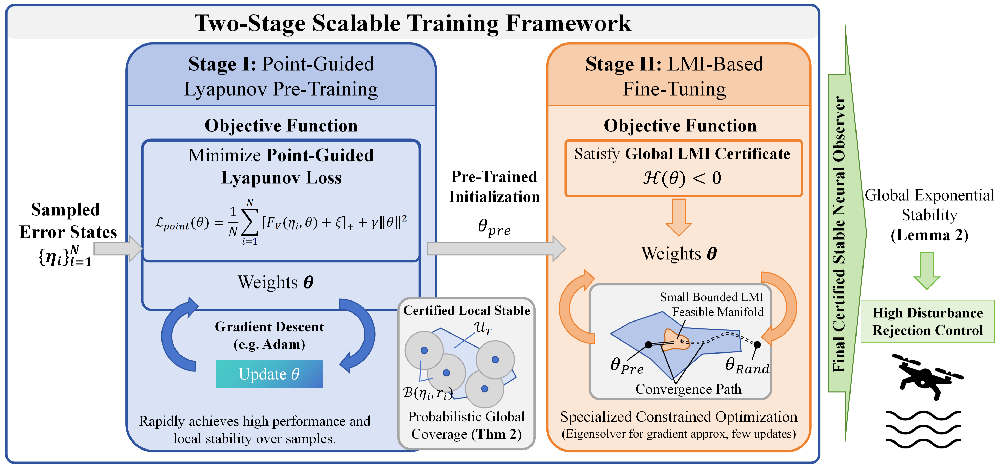
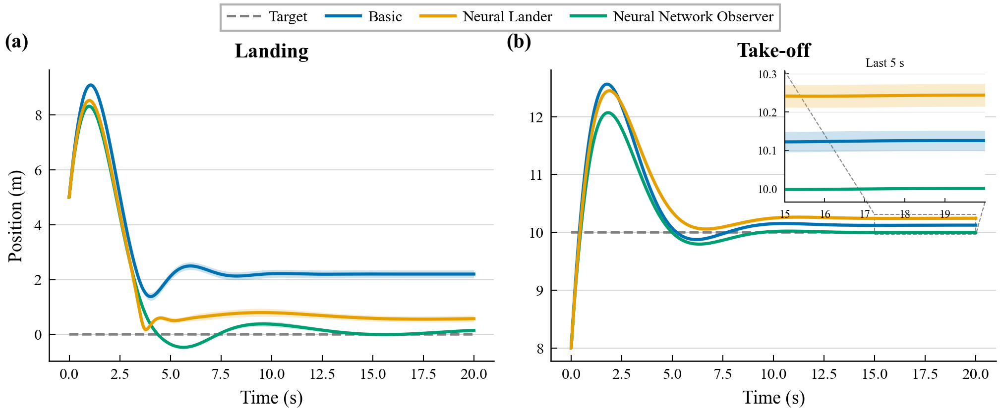
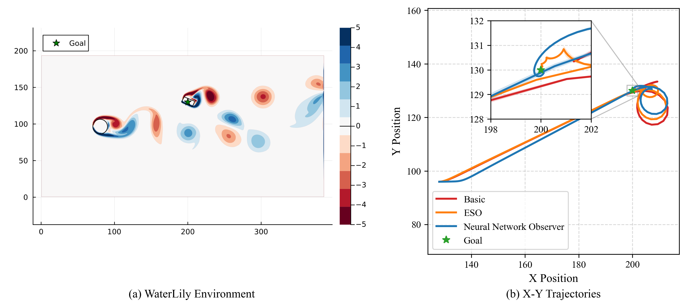
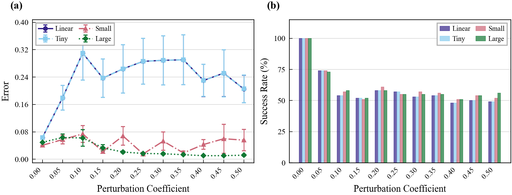
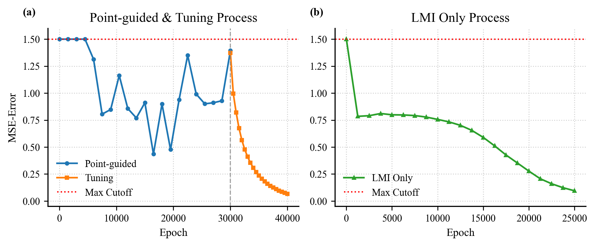

---
hide:
  - toc
---

# NeurIPS2026（Poster）

<article class="course-main course-article" markdown="1">

## 基本记录

| 项目 | 记录 |
| --- | --- |
| 标题 | Learning Provable Neural Network Observer for Uncertain Dynamical Systems |
| 状态 | 已录用（Poster） |
| 会议 | NeurIPS 2026 |
| 主题 | 不确定动力系统中的可证明神经网络观测器 |
| 论文 | [arXiv:2609.30819](https://arxiv.org/abs/2609.30819) · [PDF](https://arxiv.org/pdf/2609.30819) |
| 公开日期 | 2026 年 9 月 25 日 |
| 代码 | [LearningNeuralNetworkObserver](https://github.com/Berry-Myon/LearningNeuralNetworkObserver) |

## 研究主题

我研究带外部扰动和未建模动态的控制系统。控制器需要状态和扰动估计，神经网络观测器能拟合复杂不确定项。通过 LMI 约束证明 Lyapunov 稳定性时，网络规模增大会使对应的 SDP 求解耗时增加，并带来数值困难。

我采用两阶段训练：

1. Point-Guided Lyapunov Pre-Training：在误差状态空间采样，先用点值 Lyapunov 损失训练高容量观测器。
2. LMI-Based Fine-Tuning：从预训练参数出发，微调到满足 \(H(\theta)\prec O\)，得到全局 Lyapunov 证书。

## 系统与观测器

不确定非线性动力系统写成：

\[
\begin{aligned}
\dot{x}(t) &= Ax(t)+Bu(t)+B_\omega K(x,d,t),\\
y(t) &= Cx(t).
\end{aligned}
\]

其中 \(K(x,d,t)\) 表示非线性动态和外部扰动。观测器用于同时估计状态和扰动：

\[
\begin{aligned}
\dot{\hat{x}}_1(t) &= A\hat{x}_1(t)+Bu(t)+B_\omega\hat{x}_2(t)+\pi_{\theta,1}\!\left(\epsilon^{-1}(y(t)-\hat{y}(t))\right),\\
\dot{\hat{x}}_2(t) &= \epsilon^{-1}\pi_{\theta,2}\!\left(\epsilon^{-1}(y(t)-\hat{y}(t))\right),\\
\hat{y}(t)&=C\hat{x}_1(t).
\end{aligned}
\]

误差变量定义为 \(\eta_1=\epsilon^{-1}(x-\hat{x}_1)\)、\(\eta_2=K(x,d,t)-\hat{x}_2\)。误差系统为：

\[
\dot{\eta}(t)=A_\epsilon\eta(t)-\nu(\eta,\theta)+\epsilon w(t).
\]

对二次 Lyapunov 函数 \(V(\eta)=\eta^\top P\eta\)，我使用的点值上界为：

\[
F_V(\eta,\theta)
=\eta^\top(A_\epsilon^\top P+PA_\epsilon+\rho P)\eta
-2\nu(\eta,\theta)^\top P\eta
+2\epsilon M_w\|P\eta\|.
\]

若所考虑状态域中的各点均满足 \(F_V(\eta,\theta)\le 0\)，则有 \(\dot{V}\le -\rho V\)。

## 两阶段训练

第一阶段的损失函数为：

\[
L_{\mathrm{point}}(\theta)=
\frac{1}{N}\sum_{i=1}^{N}\left[F_V(\eta_i,\theta)+\xi\right]_+
+\gamma\|\theta\|^2.
\]

这里 \(\xi>0\) 是严格稳定裕度。若数据项为零，则每个采样点满足：

\[
F_V(\eta_i,\theta^*)\le -\xi<0.
\]

第二阶段从 \(\theta_{\mathrm{pre}}\) 出发，使用 LMI 罚函数：

\[
L_{\mathrm{LMI}}(\theta)=
\phi\!\left(\lambda_{\max}(H(\theta))\right)+\beta\|\theta\|^2.
\]

我将 \(\theta_{\mathrm{pre}}\) 作为初始化，微调网络直至 \(H(\theta)\prec O\)。在对应的 LMI 稳定性条件下，充分减小增益参数 \(\epsilon\) 时，观测误差趋近于零。

## 理论分析

局部稳定半径来自采样点附近的连续性。若 \(F_V(\eta_s,\theta)\le-\xi<0\)，在 Lipschitz 条件下存在邻域 \(B(\eta_s,r_s)\cap\mathcal{X}\)，使其中的点仍满足 \(F_V(\eta,\theta)\le0\)。当 \(C_2>0\) 时，半径可取二次方程正根：

\[
C_2r_s^2+C_1(\eta_s)r_s+F_V(\eta_s,\theta)=0.
\]

采样点形成的稳定区域记作：

\[
U_T=\bigcup_{i=1}^{T}\left(B(\eta_i,r_i)\cap\mathcal{X}\right).
\]

在紧致误差状态域 \(\mathcal{X}\) 上，假设成功样本独立来自具有全支撑的分布，且各采样点的稳定半径具有统一正下界 \(r_i\ge r_{\min}>0\)，则存在常数 \(N_{\mathrm{cov}}\) 和 \(q>0\)，满足：

\[
\mathbb{P}(\mathcal{X}\subset U_T)\ge 1-N_{\mathrm{cov}}(1-q)^T.
\]

因此，成功样本数量增加时，采样稳定区域覆盖整个误差状态域的概率趋近于 1。

## 实验结果

### Quad-UAV：地面效应下的起飞与降落

我用 Basic PID、PID + Neural Lander 和 PID + Neural Network Observer 比较垂直轨迹跟踪。Neural Lander 使用 40,000 个数据点学习任务相关的前馈补偿，神经网络观测器在线估计扰动力 \(f_a\)，并将推力修正为 \(T_{\mathrm{cmd}}'=T_{\mathrm{cmd}}-\hat f_a\)。

表中误差为均值 ± 标准差。在底层系统不变时，神经网络观测器复用同一组训练参数。

| 方法 | 数据需求 | 训练时间 | 降落误差 / m | 起飞误差 / m |
| --- | --- | --- | --- | --- |
| Basic PID | 不需要 | — | \(2.2006\pm0.1456\) | \(0.1255\pm0.0266\) |
| PID + Neural Lander | 需要 | 88.2 s，每个任务重训 | \(0.5732\pm0.1188\) | \(0.2444\pm0.0297\) |
| PID + Neural Network Observer | 不需要 | 233.8 s，一次训练 | \(0.1471\pm0.0602\) | \(0.0002\pm0.0000\) |

### WaterLily：流体扰动下的 AUV 轨迹跟踪

我在 WaterLily 中模拟 von Kármán 涡街，网格大小为 \(384\times192\)，上游流速为 \(U=10.0\)，雷诺数为 \(Re=200\)。AUV 从 \((128,96)\) 出发，穿过圆柱尾流，驶向目标 \((200,130)\)。NMPC 的预测时域为 \(H=20\)，ESO 带宽为 \(\omega_0=15\)。

跟踪误差为均值 ± 标准差：

| 方法 | 跟踪误差 / m |
| --- | --- |
| Basic NMPC | \(1.4932\pm0.0199\) |
| NMPC + ESO | \(0.0959\pm0.0088\) |
| NMPC + Neural Network Observer | \(0.0499\pm0.0019\) |

### X-29：网络容量与结构扰动

我比较 Linear、Tiny NN、Small NN 和 Large NN 四种观测器。Tiny NN 的隐藏层为 \([3,3,3]\)，Small NN 为 \([32,64,32]\)，Large NN 使用八层 ResNet，隐藏层为 \([32,64,64,128,128,64,64,32]\)。对应的隐藏神经元总数为 9、128 和 576。

我对系统矩阵 \(A\) 和输出矩阵 \(C\) 加入结构扰动：

\[
X'=X+\sigma\frac{Y}{\|Y\|}\|X\|,\qquad X\in\{A,C\}.
\]

其中 \(Y\) 的元素独立服从标准正态分布。每个扰动强度下运行 100 次独立试验，每次模拟 20 s。整个时域内满足 \(\|x(t)\|\le3.0\) m 的试验计为成功，跟踪误差在成功试验中统计。

在 \(\sigma=0.5\) 下，误差为均值 ± 均值标准误：

| 观测器 | 跟踪误差 / m | 成功率 |
| --- | --- | --- |
| Linear | \(0.2052\pm0.0402\) | 0.49 |
| Tiny NN | \(0.2056\pm0.0402\) | 0.49 |
| Small NN | \(0.0558\pm0.0312\) | 0.52 |
| Large NN | \(0.0118\pm0.0028\) | 0.56 |

### X-29：训练效率与两阶段消融

我用 Large NN 比较点值预训练、纯 LMI 优化与两阶段训练。纯 LMI 梯度下降耗时 2210.39 s，两阶段训练耗时 895.31 s，约加速 2.5 倍。

| 方法 | 时间 / s | MSE |
| --- | --- | --- |
| Point-Guided | 99.53 | 1.0645 |
| LMI Gradient Descent | 2210.39 | 0.0707 |
| Point & LMI Tuning | 895.31 | 0.0499 |

</article>

<aside class="course-index" aria-label="白玉楼索引">
  
文章列表

  <a class="course-index__home" href="index.html">总览</a>
  

论文
<a class="is-active" href="neurips2026.html">NeurIPS2026（Poster）</a>

  

组会
<a href="lyge.html">LYGE</a><a href="neural-observer-i.html">Neural Observer I</a><a href="feedback-linearization.html">反馈线性化</a><a href="sima.html">SIMA</a><a href="neural-observer-ii.html">Neural Observer II</a><a href="neural-observer-iii.html">Neural Observer III</a><a href="dream2flow.html">Dream2Flow</a><a href="neural-observer-iv.html">Neural Observer IV</a>

</aside>

